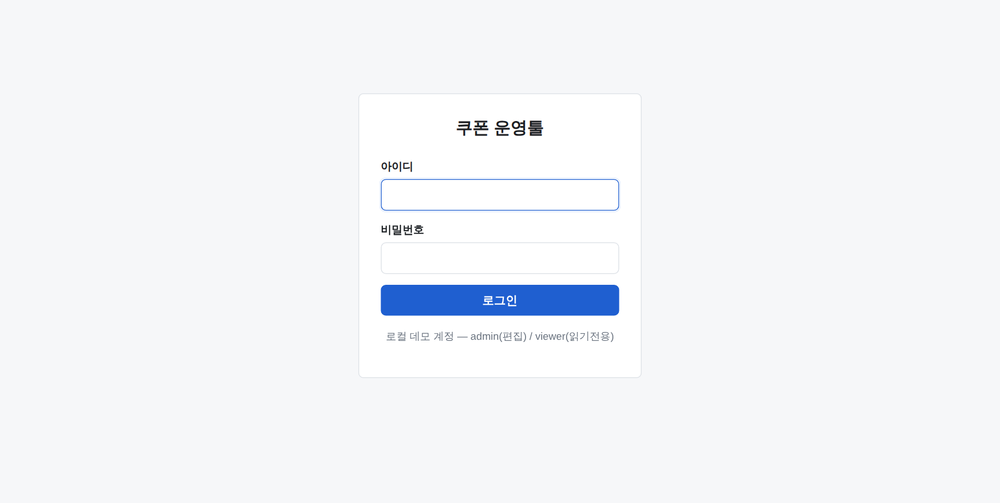
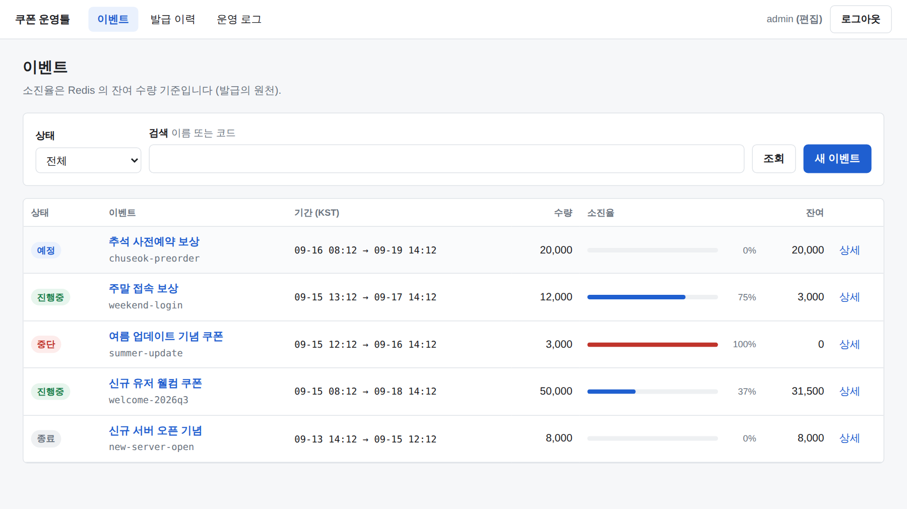
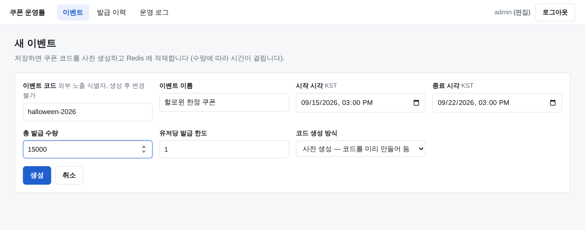
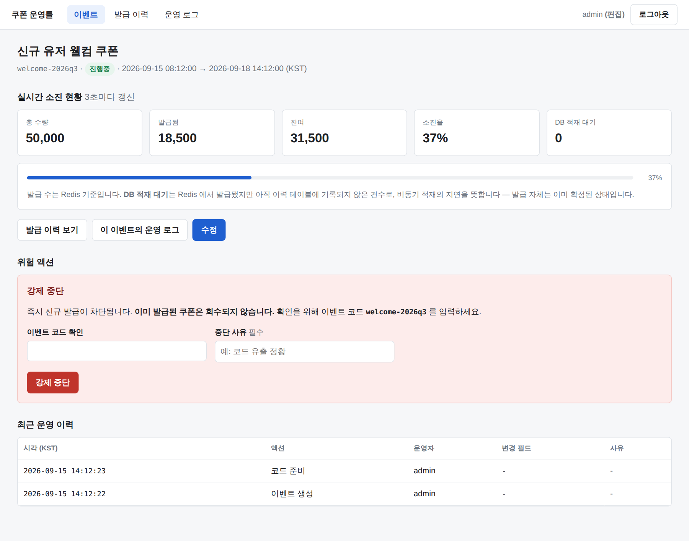
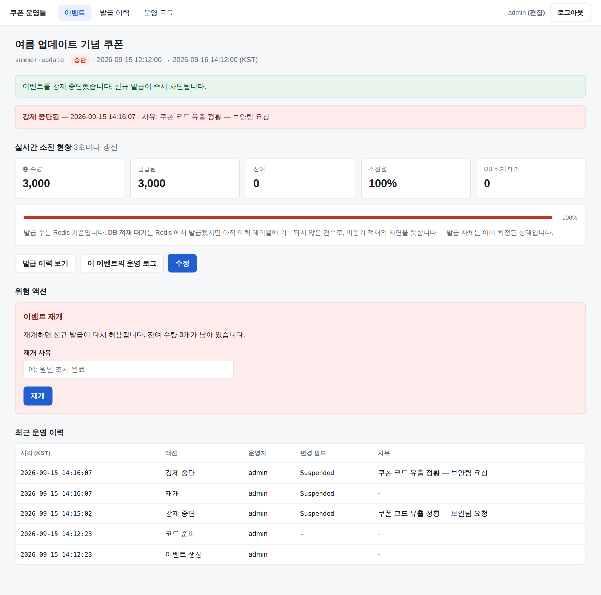
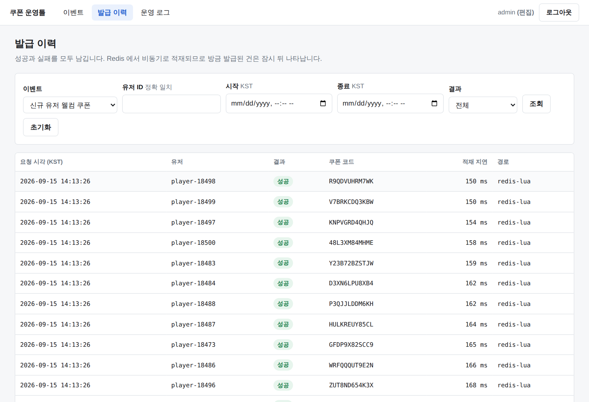
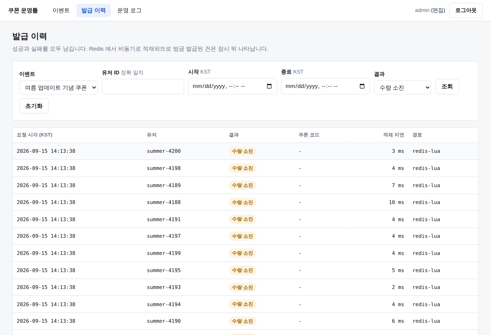
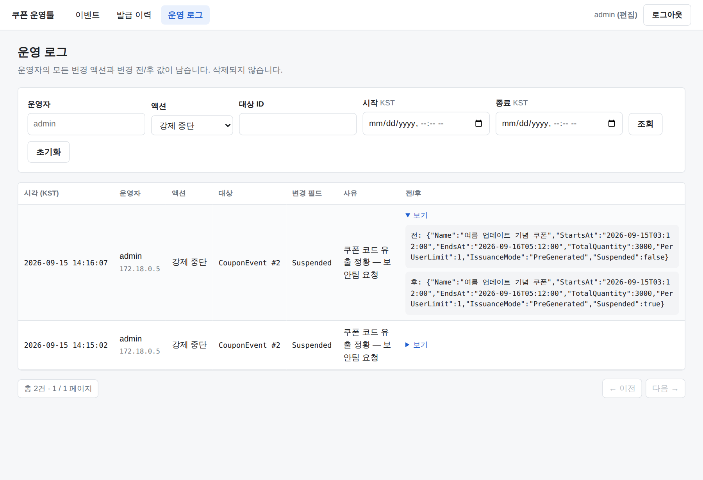
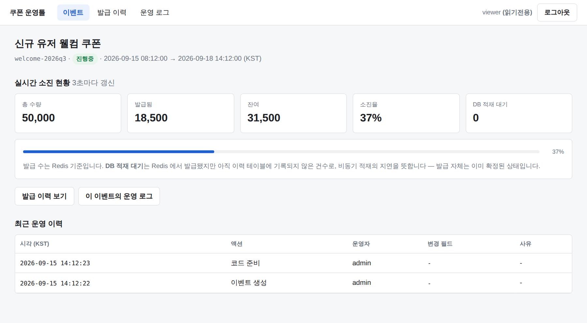
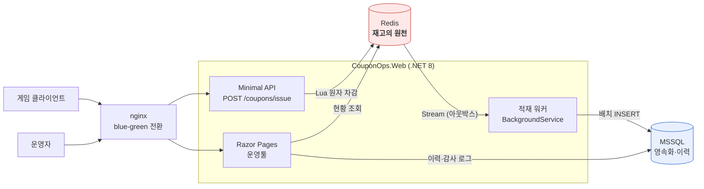

# coupon-ops-tool

**선착순 쿠폰 발급 API와 운영툴.**
동시 요청이 아무리 몰려도 발급 수가 설정 수량을 넘지 않는다 — 그것을 실행 가능한 테스트와 부하 측정으로 증명한다.

[](https://github.com/hyunolike/game-event-ops-poc/actions/workflows/ci.yml)


> English: [README.md](README.md)

---

## 해결한 문제

이벤트가 열리는 순간 수만 명이 같은 1초 안에 *받기* 를 누른다.

재고를 읽고, 판단하고, 차감한다 — 그 사이에 다른 요청이 끼어든다. 두 사람이 같은 쿠폰을 가져간다.
원자적인 `DECR` 만 쓰면 카운터가 음수로 내려간다. 없는 쿠폰을 약속한 것이다.

둘 다 되돌릴 수 없다. **유저 손에 들어간 쿠폰은 회수할 수 없다.**

흔한 답은 DB 잠금이다. 정확하다 — 그리고 이 프로젝트는 그 정확성의 값이 얼마인지 측정한다.

---

## 어떻게 풀었는가

재고 차감·유저 한도·멱등 처리를 **하나의 Lua 스크립트 안에서** 한다.
Redis 에서 스크립트는 단일 원자 단위로 실행되므로, 그 안에서는 "확인 후 차감" 이 안전하다.

```
1. 멱등 검사       GET  {evt:N}:req:<rid>      → 있으면 최초 결과 재생
2. 메타 로드       HMGET {evt:N}:meta
3. 거부 검증(읽기)  중단 → 기간 → 유저 한도
4. 코드 확보       LPOP {evt:N}:pool           ← 재고 판정과 코드 배정을 겸한다
5. 발급 확정(쓰기)  HINCRBY users / SET req / XADD issued
```

순서를 지배하는 원칙이 둘이다.

**멱등 검사가 가장 먼저다.** 기간 검사를 먼저 두면 "이미 발급받은 유저가 종료 후 재시도" 가
`OutOfPeriod` 로 응답되어 최초 결과와 달라진다 — 멱등성이 깨진다.

**읽기 검증을 전부 끝낸 뒤에야 쓰기를 시작한다.** Redis 는 Lua 실행 중 오류가 나도
**앞서 실행된 명령을 되돌리지 않는다.** 되돌릴 트랜잭션이 없다.
검증과 쓰기를 섞으면 뒤쪽에서 거부될 때 앞에서 깎은 재고가 그대로 증발한다.

예외는 `LPOP` 하나다. 쓰기지만 실패 시(nil) 아무것도 바꾸지 않아 되돌릴 것이 없고,
**재고 판정과 코드 배정을 겸하므로** "재고는 깎였는데 코드가 없다" 는 상태가 구조적으로 생기지 않는다.

→ [docs/02-issue-api.md](docs/02-issue-api.md) ·
[issue_coupon.lua](src/CouponOps.Web/Infrastructure/Redis/Scripts/issue_coupon.lua)

---

## 수치 — Redis Lua vs DB 비관적 락

같은 규칙·같은 이력 스키마로 **세 경로를 같은 조건에서** 측정했다.
셋 다 **초과 발급 0건** 이다 — 정확성을 포기해서 얻은 속도가 아니다.

| 경로 | VU | 처리량 | p50 | p95 | p99 |
|---|---:|---:|---:|---:|---:|
| **Redis Lua** | 200 | **8,912/s** | 14 ms | 37 ms | **64 ms** |
| DB 이벤트행 락 | 200 | 223/s | 779 ms | 1,008 ms | 1,552 ms |
| DB READPAST | 200 | 395/s | 328 ms | 860 ms | 2,246 ms |
| **Redis Lua** | 3,000 | **8,495/s** | 145 ms | 391 ms | **551 ms** |
| DB 이벤트행 락 | 3,000 | 202/s | 12,069 ms | 15,156 ms | 15,804 ms |
| DB READPAST | 3,000 | 322/s | 6,605 ms | 10,914 ms | 14,596 ms |

**처리량 22~44배, p99 응답시간 1/25~1/29.**

기울기가 핵심이다. **DB 는 VU 를 15배 늘려도 처리량이 그대로고**(223 → 202) 대기 시간만 15배 늘어난다.
그것이 직렬화의 정의다 — 더 많이 몰려와도 초당 처리량은 변하지 않고 줄만 길어진다.

### 소진 정확성 (재고 10,000 / VU 300)

| 경로 | 발급 성공 | 초과 발급 |
|---|---:|---:|
| Redis Lua | **10,000** | 0 |
| DB 이벤트행 락 | **10,000** | 0 |
| DB READPAST | **10,000** | 0 |

Redis 경로는 총 **251,957건**의 요청을 처리하면서 정확히 10,000건만 발급했다.

> **비교군을 제대로 만드는 데 시간을 썼다.** 처음 구현한 DB 경로는 200 VU 에서 **5.6 req/s**,
> 요청의 94%가 타임아웃이었다. 실행 계획을 떠보니 유저 한도 조회가 **인덱스 스캔**이었고,
> 그 질의에 걸린 `UPDLOCK, HOLDLOCK` 때문에 **모든 트랜잭션이 25만 행에 범위 잠금**을 걸고 있었다.
> 필터드 인덱스 하나로 **5.6 → 223 req/s (40배)**.
> 그 상태로 리포트했다면 "Redis 가 1,500배 빠르다" 는 거짓 결론이 나왔을 것이다.

→ 측정 환경의 한계까지 포함한 전문: [docs/load-test.md](docs/load-test.md)

---

## 운영툴

별도 SPA 없이 Razor Pages 로 구현했다. CSS 프레임워크 없이 순수 CSS 157줄.

### 1. 로그인 — 읽기전용 / 편집 권한 구분



쿠키 인증(8시간, `HttpOnly`, `SameSite=Strict`).
Razor Pages 는 `AuthorizeFolder("/")` 로 **기본값이 "로그인 필요"** 라, 새 페이지에서 인증을 깜빡해도 열리지 않는다.

### 2. 이벤트 목록 — 상태 필터와 소진율



소진율은 **Redis** 기준이다. 재고의 원천이 거기이고, DB 는 뒤따라온다.
상태 필터는 SQL 술어로 번역되므로(`CouponEvent.IsStatus`) 전건을 읽어 메모리에서 거르지 않는다.

`예정`·`진행중`·`종료` 는 **저장하지 않는다.** 시각의 함수이므로 읽을 때 파생한다.
저장하는 것은 운영자 액션인 `중단` 뿐이다 — 나머지를 저장하면 스케줄러가 밀리는 순간 DB 에 거짓이 남는다.

### 3. 이벤트 생성 — 검증 후 Redis 워밍업까지



저장하면 쿠폰 코드를 사전 생성해 `SqlBulkCopy` 로 적재하고 Redis 풀을 채운다.
리다이렉트가 끝난 시점에 **이미 발급 가능한 상태**다.

### 4. 이벤트 상세 — 실시간 소진 현황(폴링)



`GET /api/events/{id}/status` 를 3초마다 호출한다. **WebSocket 을 쓰지 않는다** —
보는 사람은 운영자 몇 명이고 3초 지연은 의사결정에 영향이 없는데, 소켓은 연결 관리·재연결·
스케일아웃 백플레인 비용을 달고 온다. 탭이 백그라운드면 폴링을 멈춘다. 운영툴은 열어둔 채 방치된다.

`DB 적재 대기` 는 Redis 기준 발급 수와 이력 테이블 행 수의 차이다.
"발급은 됐는데 이력이 안 보인다" 는 문의를 만들지 않고, 비동기 적재 구조를 화면에서 그대로 드러낸다.

### 5. 강제 중단 — 세 겹의 확인 절차



중단은 되돌릴 수 없다. 이미 나간 쿠폰은 회수되지 않는다. 그래서

1. **이벤트 코드를 직접 입력한다.** `confirm()` 은 옆 탭의 다른 이벤트를 중단시키는 실수를 막지 못한다.
   대상을 직접 지목하게 해야 한다.
2. **중단 사유는 필수다.** 사유 없는 중단은 사후 조사에서 아무것도 설명하지 못한다.
3. 브라우저 `confirm()` — 오클릭 방어.

1·2 는 **서버에서 검증한다.** 클라이언트 검증은 방어가 아니다.

### 6. 발급 이력 — 성공과 실패를 모두 남긴다



발급됨·수량 소진·기간 외·한도 초과·중복 요청. 이벤트·유저ID·기간·결과로 필터하고 페이징한다.



유저 조회는 `LIKE '%…%'` 가 아니라 정확 일치다. 이 테이블은 이 시스템에서 가장 큰 테이블이고,
`(UserId, RequestedAt)` 인덱스는 술어가 그것을 쓸 수 있을 때만 도움이 된다. CS 문의도 유저 ID 를 정확히 안다.

### 7. 운영 로그 — 모든 변경의 전/후



`"Suspended": false` → `"Suspended": true`, 수행자·IP·사유·바뀐 필드 목록까지.
**`SaveChanges` 는 호출자가 한다** — 변경과 감사 로그가 같은 트랜잭션에서 커밋되므로
"바뀌었는데 기록이 없는" 창이 없다.

로그인도 감사 대상이다. *누가 언제 들어왔나* 는 사고 조사의 첫 질문이다.

### 8. 읽기전용 계정에는 위험 액션이 보이지 않는다



버튼을 숨기는 것이 방어가 아니다 — 핸들러가 권한을 다시 확인하고,
읽기전용 계정으로 폼을 직접 POST 해도 상태가 바뀌지 않는 것을 통합 테스트가 단언한다.

---

## 룰렛 — 확률 지급 이벤트

선착순 쿠폰이 "정확히 N개" 를 보증하는 문제라면, 룰렛은 거기에 **결과가 확정적이지 않다** 는
문제가 얹힌다. 같은 엔진(멱등·원자성·아웃박스·감사 로그) 위에 세 가지를 더 풀었다.

### 1. 확률은 저장하지 않는다 — 가중치만 저장한다

`probability = 0.005` 대신 `weight = 5 / total = 1000`.
부동소수 합산 오차가 없어 "합이 정확히 100%" 를 검증할 수 있고, 슬롯을 하나 추가할 때
나머지를 건드리지 않아도 되며, 추첨이 정수 나머지 연산(`roll = rand % totalWeight`)으로 끝난다.

표시 확률은 읽을 때 계산한다 — 이벤트 상태를 파생시키는 것과 같은 원칙이다.
그리고 **어드민 미리보기와 공개 공시가 같은 함수를 쓴다.** 둘이 다른 계산을 하는 순간
언젠가 반드시 어긋나고, 어긋난 공시는 그 자체로 사고다.

### 2. 재고 소진은 재분배가 아니라 대체로 흡수한다

소진된 슬롯을 빼고 남은 가중치로 다시 뽑으면(재분배), **1등이 소진되는 순간 2등 확률이
저절로 올라가 공시가 거짓이 된다.** 유저는 그걸 알 방법이 없다.

그래서 소진된 슬롯이 뽑히면 지정된 대체 경품으로 치환한다. 공시 확률 = 실행 확률이 항상 유지되고,
부수적으로 **누적 가중치 배열이 이벤트 기간 내내 불변**이라 워밍업 때 한 번 만들면 끝이다.
재분배 정책은 코드에서 아예 거부한다.

### 3. 난수는 Lua 안에서 뽑지 않는다

`RandomNumberGenerator` 로 앱에서 뽑아 `ARGV` 로 넘긴다.
원자성이 필요한 것은 *선택 + 차감* 이지 *난수 생성* 이 아니고, 밖에서 만들어야
**그 값을 이력에 남겨 사후에 추첨을 그대로 재계산할 수 있다.**

```
DrawLog(WeightVersionId, RandomValue)  →  Recompute()  →  저장된 PrizeId 와 일치?
```

CS 클레임·내부 감사·규제 대응·버그 조사가 전부 이 한 줄에서 끝난다.
운영툴의 이력 화면에는 행마다 **[재현 검증]** 버튼이 있다.

확률 변경은 UPDATE 가 아니라 `DrawWeightVersion` 새 버전 활성화다(append-only).
과거 이력이 새 확률표를 가리키면 그 추첨을 더 이상 설명할 수 없기 때문이다.

### 추첨 스크립트의 세 번째 원칙

쿠폰 스크립트의 두 원칙(멱등 검사가 가장 먼저 / 읽기 검증을 끝낸 뒤 쓰기)에 하나가 붙는다.

> **티켓 차감은 쓰기 구간의 맨 앞이고, 그 뒤로 실패 분기가 없어야 한다.**
> "티켓은 빠졌는데 아무것도 못 받았다" 가 유저 입장에서 가장 나쁜 실패다.

그래서 슬롯 결정·재고 판정·대체 치환까지 전부 읽기 단계에서 끝낸다.

→ [docs/04-roulette-design.md](docs/04-roulette-design.md) ·
[draw_spin.lua](src/CouponOps.Web/Infrastructure/Redis/Scripts/draw_spin.lua)

### 4. 지급은 우편함을 거친다

추첨은 우편을 만들고, 지급은 유저가 수령할 때 확정된다. 인벤토리에 직접 꽂지 않는 이유는
**미수령분을 되돌릴 수 있다**는 것 하나로 충분하다 — 잘못 설정된 경품을 회수할 수 있는
유일한 창이 그 구간이고, 인벤토리에 들어간 뒤에는 방법이 없다.

수령 동시성은 `RowVersion` 이 잡는다. 규칙은 `TryClaim` 한 곳에만 두고, 같은 조건을
WHERE 절에 복사해 두 곳에서 관리하지 않는다. 중복 클릭은 오류가 아니라 이미 달성된
상태이므로 `200 + AlreadyClaimed` 다.

```
POST /api/draws/{id}/spin            추첨 → 우편 생성
GET  /api/draws/{id}/mails           미수령 목록
POST /api/draws/{id}/mails/{m}/claim 수령
```

### 5. 확률 변경에는 두 사람이 필요하다

이미 시작된 이벤트의 확률 변경은 **등록자와 다른 편집자**가 승인해야 적용된다.
`CanBeDecidedBy(adminId)` 한 줄이 절차의 전부다 — 자기가 올린 것을 자기가 통과시킬 수 있으면
절차는 형식이고, 사고가 났을 때 "두 사람이 봤다" 고 말할 수 없다.

반대로 **시작 전 이벤트는 승인 없이 바꾼다.** 아직 아무도 뽑지 않았으므로 되돌릴 것이 없고,
절차를 불필요한 곳까지 늘리면 운영자는 절차를 우회할 방법을 찾는다.

승인 화면은 바뀌는 슬롯만, **배율과 함께** 보여준다 — `5 → 50` 같은 자릿수 실수는
절대값보다 배율에서 먼저 보인다.

### 운영툴에서 막는 것

| 화면 | 막는 사고 |
|---|---|
| 슬롯 편집기 + **시뮬레이터 게이트** | 가중치 `5` 를 `50` 으로 친 오타. 시뮬레이션을 보지 않으면 저장이 안 된다 |
| 대체 경품 단일 선택 | 유한 재고끼리 대체를 걸어 치환이 연쇄·순환하는 설정 |
| **2인 승인** | 혼자 누른 확률 변경. 진행 중 이벤트에만 걸고, 시작 전에는 걸지 않는다 |
| 실시간 편차 + 카이제곱 | 가중치 오류 · 워밍업 불일치 · 어뷰징 |
| 확률 버전 이력 | "그때 확률이 뭐였나" 에 답할 수 없는 상태 |
| 강제 중단 3중 확인 | 옆 탭의 다른 이벤트를 중단시키는 실수 |
| **미수령분 회수** | 잘못 설정된 경품. 이미 수령한 우편은 대상이 아니다 |
| 공시 페이지 자동 생성 | 어드민 확률표와 공시가 어긋나는 것 |

### 이상 탐지 — 판정이 아니라 "봐야 할 것"

잭팟 반복 당첨 · 추첨 폭주 · **같은 IP 의 다계정 잭팟** 셋을 띄운다.
자동으로 회수하거나 차단하지 않는다 — 0.5% 짜리 잭팟을 세 번 받는 일은 확률적으로
불가능하지 않고, **오탐 한 건의 비용이 탐지 이득보다 크다.**

IP 축에는 전제가 붙는다. 프록시 뒤에서 `X-Forwarded-For` 를 검증 없이 믿으면 누구나
자기 IP 를 위조할 수 있고, 그러면 이 축은 탐지 도구가 아니라 **남에게 혐의를 씌우는 도구**가 된다.
그래서 신뢰할 프록시를 명시한 경우에만 헤더를 해석하고, 설정이 없으면 **아예 돌리지 않는다.**
설정 없이 돌리면 전원이 프록시 IP 하나로 보여 모두가 이상 징후로 뜨는데, 그 화면을 한 번 본
운영자는 이후 이상 탐지 전체를 신뢰하지 않게 된다.

```bash
curl -X POST http://localhost:8080/api/draws/1/spin \
  -H 'Content-Type: application/json' \
  -d '{"userId":"player-1234","requestId":"3f2b8c10-0000-4000-8000-000000000001"}'
```

### 측정 — 아직 비어 있다

쿠폰 경로처럼 수치로 증명할 자리를 만들어 뒀지만 **아직 돌리지 않았다.**
하네스(`loadtest/run-draw.sh`)는 실행이 끝날 때마다 현황 API 에 직접 물어
**한정 경품 당첨 수가 재고를 넘었는지** 확인하고, 넘었으면 0이 아닌 종료 코드로 끝난다 —
측정이 곧 검증이다. 추정치를 적으면 비교표 전체의 신뢰가 무너지므로 비워 둔다.

```bash
STOCK=5000 bash loadtest/run-draw.sh /tmp/draw-results
```

---

## 실행

```bash
docker compose up -d --wait
```

| | |
|---|---|
| 운영툴 · API | http://localhost:8080 |
| 계정 | `admin`, `admin2` (편집) · `viewer` (읽기전용) — 비밀번호 모두 `admin1234` |
| 확률 공시 | http://localhost:8080/Odds?code=&lt;이벤트코드&gt; (로그인 불필요) |
| 헬스체크 | http://localhost:8080/health/ready |

```bash
curl -X POST http://localhost:8080/api/events/1/coupons/issue \
  -H 'Content-Type: application/json' \
  -d '{"userId":"player-1234"}'
```

편집 계정이 둘인 것은 의도적이다 — 확률 변경의 2인 승인은 등록자와 다른 편집자가 있어야 성립한다.

```bash
dotnet test                                    # 통합 테스트 (실제 MSSQL·Redis)
bash loadtest/run-comparison.sh /tmp/results   # 쿠폰 3경로 × 3 VU 레벨
bash loadtest/run-draw.sh /tmp/draw-results    # 룰렛 3 VU 레벨 + 초과 지급 0건 확인
bash deploy/deploy.sh couponops:local          # 무중단 배포 (blue-green)
```

---

## 아키텍처



**Redis 가 재고의 원천이고, DB 는 비동기로 따라온다.**
유저가 기다리는 시간과 DB 가 감당하는 시간이 분리돼 있다 — 실측 **API 19ms**, **DB 적재 완료 1.5초**.

소비는 at-least-once 라 같은 항목이 두 번 올 수 있다. `IssuanceLogs.RequestId` 의 UNIQUE 제약과
워커의 선필터가 중복을 막고, 쿠폰 상태 변경과 이력 적재는 한 트랜잭션에서 커밋된다.

---

## 기술 선택 근거

### 왜 Redis Lua 인가, 그리고 Redis 가 죽으면

DB 트랜잭션과의 차이는 우연이 아니라 구조다.

| | Redis Lua | DB 트랜잭션 |
|---|---|---|
| 차감 단위 | 인메모리 정수 연산 1회 | 트랜잭션 시작 → 잠금 → I/O → 커밋 |
| 직렬화 범위 | 스크립트 단위 (수 µs) | 잠금 보유 시간 전체 (수 ms) |
| 커넥션 | 발급 중 DB 커넥션 **0개** | 요청당 1개를 트랜잭션 내내 점유 |
| 응답까지 필요한 작업 | 재고 차감만 | 재고 차감 + 이력 INSERT |

**Redis 장애 시에는 fail-fast 한다 — DB 로 우회하지 않는다.**
재고의 원천이 둘이 되는 순간 "정확히 N개" 를 보증할 수 없다. Redis 가 끊긴 사이 DB 경로로 나간 수량은
Redis 카운터에 반영되지 않고, 복구된 Redis 는 자기가 아는 재고로 계속 발급한다.
초과 발급은 보상이 어렵지만 짧은 발급 거부는 재시도로 회복된다. 비대칭적인 비용이므로 거부를 택했다.

기동 시점은 다르게 다룬다. `AbortOnConnectFail = false` 로 컨테이너 기동 순서 때문에 앱이 죽지 않게 하고,
**요청 처리 중의 연결 실패만** fail-fast 대상이다.

### 왜 Razor Pages 인가

- 별도 SPA 는 빌드 파이프라인·상태 관리·API 스키마 동기화 비용을 달고 온다.
  목록·폼·상세 화면에는 그것이 필요 없다.
- 서버 렌더링이라 **인증·권한 판단이 한 곳에 모인다.** SPA 였다면 화면 가드와 API 가드를
  양쪽에 두고 어긋나지 않게 관리해야 한다.
- 단일 프로젝트라 배포 단위가 하나다.

### 왜 쿠폰 코드를 사전 생성하는가

발급 시 생성하면 코드와 재고가 별개 자원이 되어 원자성을 따로 보증해야 한다.
사전 생성하면 `LPOP` 한 번이 둘을 겸한다 — 증명할 것이 하나 줄어든다.

발급 시 파생하는 `Derived` 모드도 구현했다. `INCR` 시퀀스에서 코드를 파생하므로
(`Base32(HMAC(secret, eventId‖seq))`) 충돌이 운이 아니라 구조적으로 불가능하고,
시퀀스를 그대로 노출하지 않아 추측도 어렵다.

→ [docs/01-domain-design.md](docs/01-domain-design.md)

---

## CI/CD

```
브랜치 푸시 / PR  →  빌드 · 테스트 · 커버리지  →  무중단 배포 · 롤백 시연
main 머지        →  이미지 빌드 · GHCR 푸시
```

**`deploy-smoke` 잡이 매 실행 실제 배포와 실제 롤백을 수행한다.**
배포하는 동안 프록시로 요청을 계속 보내고, **실패가 한 건이라도 나오면 잡이 실패한다.**
"무중단" 을 주장하려면 그것을 측정해야 한다.

| 시나리오 | 결과 |
|---|---|
| 정상 배포 (blue → green) | 요청 **471건 · 실패 0건**, 준비까지 3초 |
| 실패 주입 | 요청 **8,993건 · 실패 0건**, 전환 안 함, 트래픽 유지, 종료 코드 1 |

### 파이프라인 실측 (GitHub Actions, ubuntu-latest · 전체 5분 24초)

| 잡 · 단계 | 소요 |
|---|---:|
| **빌드 · 테스트 · 커버리지** | **2분 08초** |
| ├ 복원 (캐시 적중) | 5초 |
| ├ 빌드 (Release) | 12초 |
| ├ **테스트 46건** (Testcontainers 로 실제 MSSQL·Redis 기동) | **1분 28초** |
| └ 커버리지 리포트 + 아티팩트 | 4초 |
| **무중단 배포 · 롤백 시연** | **3분 10초** |
| ├ 이미지 빌드 | 31초 |
| ├ `docker compose up --wait` | 34초 |
| ├ **무중단 배포** (blue → green) | **15초** |
| └ **롤백 시연** (준비되지 않는 인스턴스를 일부러 배포) | **1분 37초** |

테스트가 전체의 27%인데 대부분 **MSSQL 컨테이너 기동 시간**이다.
목으로 바꾸면 빨라지지만 그러면 이 프로젝트가 증명하려는 것(실제 잠금·실제 원자성)을 검증하지 못한다.
그 교환은 하지 않았다.

커버리지: **라인 80.6%** (2,254 / 2,795), 브랜치 62.5%.

> **CI 는 제 몫을 했다.** 로컬에서는 드러나지 않던 결함 3건이 여기서 나왔고,
> 그중 둘은 전형적인 "내 머신에서는 되는데" 였다 — 배포 스크립트가 생성하는 nginx 설정을
> 마지막 배포 상태로 커밋해 둔 것, 그리고 root 컨테이너가 만든 파일을 일반 사용자로 도는
> 배포 스크립트가 덮어쓰지 못한 것. 자세한 내용은 [docs/cicd.md](docs/cicd.md).

---

## 구조

```
src/CouponOps.Web/          단일 프로젝트 (Minimal API + Razor Pages)
├─ Domain/                  엔티티·규칙 (의존성 없음)
├─ Application/             유스케이스
├─ Api/                     발급 API · 현황 · 헬스체크
├─ Infrastructure/
│  ├─ Redis/Scripts/        issue_coupon.lua · draw_spin.lua  ← 동시성 제어의 핵심
│  ├─ Persistence/          EF Core · 마이그레이션
│  └─ Workers/              비동기 적재 워커
└─ Pages/                   운영툴

tests/CouponOps.Tests/      통합 테스트 (Testcontainers, 실제 MSSQL·Redis)
loadtest/                   k6 시나리오 + 측정 스크립트 (쿠폰 · 룰렛)
deploy/                     blue-green 배포 스크립트 · nginx
docs/                       설계·측정·CI/CD·AI 활용 기록
```

폴더 경계로 의존 방향을 강제한다. PoC 규모에서 Clean Architecture 4-프로젝트 분할은
리뷰어가 코드를 따라가는 비용만 늘린다.

---

## 문서

| | |
|---|---|
| [1단계 — 도메인 설계](docs/01-domain-design.md) | ERD, 엔티티, 인덱스 설계 근거 |
| [2단계 — 발급 API와 동시성](docs/02-issue-api.md) | Lua 순서 근거, fail-fast 판단 |
| [3단계 — 운영툴](docs/03-admin-tool.md) | 권한 구분, 위험 액션 확인 절차 |
| [4단계 — 룰렛(확률 지급) 설계](docs/04-roulette-design.md) | 가중치·소진 정책·난수 위치, 재현 가능성 |
| [부하 테스트](docs/load-test.md) | 측정 환경의 한계까지 포함한 비교 리포트 |
| [5단계 — CI/CD](docs/cicd.md) | Jenkins vs Actions, 컨테이너 배포 트레이드오프 |
| [AI 활용 기록](docs/ai-usage.md) | 무엇을 AI 로 만들었고 어떻게 검증했는가 |
