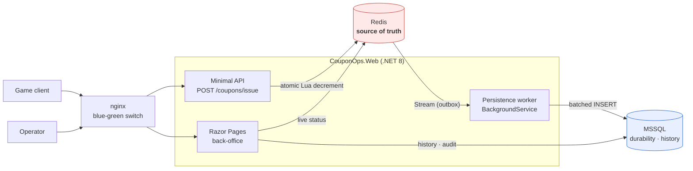

# coupon-ops-tool

**A first-come-first-served coupon issuance API and its back-office — proving that no matter how many
requests arrive at once, not one coupon is issued beyond the configured quantity.**

[](https://github.com/hyunolike/game-event-ops-poc/actions/workflows/ci.yml)


> 한국어 문서는 [README.ko.md](README.ko.md) 를 보세요. 상세 설계 문서는 모두 한국어로 작성돼 있습니다.

---

## The problem

A game announces a coupon event. At the moment it opens, tens of thousands of players hit
*Claim* within the same second.

Read the remaining stock, decide, then decrement — and another request slips in between the two
steps. Two players walk away with the same coupon. Use an atomic `DECR` alone and the counter goes
negative: you have promised more coupons than exist.

Neither failure is recoverable. **You cannot take a coupon back once it is in a player's hands.**

The usual answer is a database lock. It is correct — and this project measures exactly what it costs.

---

## How it is solved

Stock decrement, per-user limit and idempotency all happen **inside one Lua script**. Redis runs a
script as a single atomic unit, so *check-then-act* is safe in there.

```
1. Idempotency check   GET   {evt:N}:req:<rid>     → replay the original outcome if present
2. Load metadata       HMGET {evt:N}:meta
3. Rejection checks    suspended → period → per-user limit      (reads only)
4. Acquire a code      LPOP  {evt:N}:pool          ← this both tests stock and assigns the code
5. Commit the issue    HINCRBY users / SET req / XADD issued     (writes only)
```

Two principles drive that ordering.

**The idempotency check must come first.** Put the period check ahead of it and a player who already
holds a coupon gets `OutOfPeriod` when they retry after the event ends — a different answer from the
first call. Idempotency is broken.

**Every read-side check completes before the first write.** Redis does **not roll back commands that
already ran** when a Lua script fails midway. There is no transaction to unwind. Interleave checks
and writes and a later rejection leaves the stock you already decremented simply gone.

`LPOP` is the one exception. It writes, but on failure (`nil`) it changes nothing, so there is
nothing to undo — and because it **both tests stock and assigns a code**, the state
*"stock was taken but no code exists"* cannot arise at all.

Full reasoning: [docs/02-issue-api.md](docs/02-issue-api.md) ·
[issue_coupon.lua](src/CouponOps.Web/Infrastructure/Redis/Scripts/issue_coupon.lua)

---

## The numbers

Three issuance paths, same rules, same history schema, same conditions.
**All three issue exactly the configured quantity — the speed is not bought with correctness.**

| Path | VU | Throughput | p50 | p95 | p99 |
|---|---:|---:|---:|---:|---:|
| **Redis Lua** | 200 | **8,912/s** | 14 ms | 37 ms | **64 ms** |
| DB row lock on event | 200 | 223/s | 779 ms | 1,008 ms | 1,552 ms |
| DB `READPAST` | 200 | 395/s | 328 ms | 860 ms | 2,246 ms |
| **Redis Lua** | 3,000 | **8,495/s** | 145 ms | 391 ms | **551 ms** |
| DB row lock on event | 3,000 | 202/s | 12,069 ms | 15,156 ms | 15,804 ms |
| DB `READPAST` | 3,000 | 322/s | 6,605 ms | 10,914 ms | 14,596 ms |

**22–44× the throughput, 1/25–1/29 the p99 latency.**

The slope matters more than any single number. **Raise the load 15× and the DB paths move the same
amount of work** (223 → 202 req/s); only the waiting grows. That is what serialization means — more
arrivals do not increase throughput, they lengthen the queue. Redis holds its rate.

### Sell-out accuracy (stock 10,000 · 300 VU)

| Path | Issued | Over-issued |
|---|---:|---:|
| Redis Lua | **10,000** | 0 |
| DB row lock on event | **10,000** | 0 |
| DB `READPAST` | **10,000** | 0 |

The Redis path served **251,957 requests** during that run and issued exactly 10,000 of them.

> **Building a fair comparison took real work.** The first DB implementation managed **5.6 req/s**
> with 94% of requests timing out. The query plan showed the per-user-limit lookup doing an
> **index scan**, and the `UPDLOCK, HOLDLOCK` on it meant **every transaction range-locked 250,000
> rows**. One filtered index later: **5.6 → 223 req/s (40×)**.
> Shipping the first number would have produced a nonsense headline — *"Redis is 1,500× faster"*.

Method, environment and its limits: [docs/load-test.md](docs/load-test.md)

---

## The back-office

Built with Razor Pages — no separate SPA, no CSS framework (157 lines of plain CSS).
The UI is Korean because the operators are.

### 1. Sign in — read-only and editor roles


Cookie auth, 8-hour lifetime, `HttpOnly` + `SameSite=Strict`.
Razor Pages defaults to *authentication required* (`AuthorizeFolder("/")`), so forgetting to guard a
new page does not leave it open.

### 2. Event list — filter by state, see consumption at a glance


The consumption bar reads from **Redis**, the source of truth for stock — not from the database,
which trails behind. State filtering is translated to SQL (`CouponEvent.IsStatus`) so the list does
not read every row to filter in memory.

Note that `예정` (scheduled), `진행중` (active) and `종료` (ended) are **never stored**. They are
functions of the clock, derived on read. Only the operator-driven `중단` (suspended) is persisted —
store the rest and a late scheduler leaves a lie in the database.

### 3. Create an event — validated, then warmed into Redis


Saving pre-generates the coupon codes, bulk-loads them with `SqlBulkCopy` and warms the Redis pool.
When the redirect lands, the event is **already issuable**.

### 4. Event detail — live consumption, polled


`GET /api/events/{id}/status` every 3 seconds. **No WebSocket**: the audience is a handful of
operators, three seconds changes no decision, and a socket brings connection management, reconnects
and a scale-out backplane with it. Polling pauses while the tab is hidden — ops consoles get left
open.

`DB 적재 대기` (pending persistence) is the gap between Redis-side issues and rows in the history
table. Showing it stops the *"it was issued but I can't see it"* question before it is asked, and it
is honest about the asynchronous write path.

### 5. Force-stop — a dangerous action, gated three ways


Stopping an event cannot be undone — coupons already issued are not recalled. So:

1. **Type the event code.** A `confirm()` dialog does not stop you from force-stopping the event in
   the other tab. Naming the target does.
2. **A reason is mandatory.** A stop with no reason explains nothing during the post-mortem.
3. A browser `confirm()` for mis-clicks.

(1) and (2) are **validated server-side**. Client-side checks are not a defence.

### 6. Issuance history — successes *and* failures


Every attempt is recorded with its outcome: issued, sold out, out of period, per-user limit
exceeded, duplicate request. Filter by event, user ID, period and result, with paging.


User lookup is an exact match, not `LIKE '%…%'` — this is the largest table in the system and the
`(UserId, RequestedAt)` index only helps if the predicate can use it. Support tickets come with an
exact user ID anyway.

### 7. Operation log — before and after, for every change


`"Suspended": false` → `"Suspended": true`, with the actor, their IP, the reason and the list of
changed fields. **`SaveChanges` is the caller's job**, so the change and its audit record commit in
the same transaction — there is no window where something changed without a record.

Sign-ins are audited too. *Who came in, and when* is the first question of any investigation.

### 8. Read-only accounts see no dangerous actions


And hiding the button is not the defence — the handler re-checks the role, and an integration test
POSTs the form as a viewer to prove the state does not change.

---

## Roulette — probabilistic rewards

First-come coupons are a problem of guaranteeing *exactly N*. A roulette adds one more:
**the outcome is not deterministic.** Three further problems are solved on the same engine
(idempotency, atomicity, outbox, audit log).

### 1. Probabilities are never stored — only integer weights

`weight = 5 / total = 1000`, not `probability = 0.005`.
No floating-point summation error, so "the odds add up to exactly 100%" is verifiable;
adding a slot does not touch the others; and the draw ends in integer arithmetic
(`roll = rand % totalWeight`).

Displayed odds are computed on read — the same principle as deriving event state.
And **the admin preview and the public disclosure page call the same function.** The moment
they compute separately, they will eventually disagree — and a disagreeing disclosure is itself
the incident.

### 2. Sold-out stock is absorbed by substitution, not redistribution

Redistributing the remaining weight means **the second prize's real odds silently rise the
moment the first one sells out** — and players have no way to know.

So a sold-out slot is replaced by a designated fallback prize. Disclosed odds always equal
executed odds, and as a bonus the **cumulative weight array stays immutable for the whole
event** — built once at warm-up. Redistribution is rejected outright in code.

### 3. The random number is not drawn inside Lua

It is drawn by the app (`RandomNumberGenerator`) and passed in as `ARGV`.
What needs atomicity is *selection + decrement*, not *random generation* — and drawing it
outside is what makes it possible to **store the value and recompute the draw afterwards.**

```
DrawLog(WeightVersionId, RandomValue)  →  Recompute()  →  equals the stored PrizeId?
```

Support claims, internal audits, regulatory questions and bug investigations all end on that
one line. Every row in the history screen carries a **[verify]** button.

Changing odds is not an UPDATE but a new `DrawWeightVersion` activation (append-only) —
if past logs pointed at the new table, those draws could no longer be explained.

### The draw script's third principle

On top of the coupon script's two (idempotency check first; finish all read validation before
writing), one more:

> **The ticket is spent as the very first write, and no failure branch may follow it.**
> "My ticket is gone and I got nothing" is the worst failure from the player's side.

So slot selection, stock checking and fallback substitution all complete in the read phase.

→ [docs/04-roulette-design.md](docs/04-roulette-design.md) ·
[draw_spin.lua](src/CouponOps.Web/Infrastructure/Redis/Scripts/draw_spin.lua)

### 4. Rewards go through a mailbox

A draw creates mail; the grant is settled when the player claims it. One reason is enough for
not writing straight into the inventory: **unclaimed mail can be taken back.** That window is
the only chance to undo a misconfigured prize — once it is in the inventory, there is none.

Claim concurrency is caught by `RowVersion`. The rule lives in `TryClaim` alone, not copied
into a WHERE clause to be maintained in two places. A double click is not an error but an
already-reached state, so it answers `200 + AlreadyClaimed`.

```
POST /api/draws/{id}/spin            draw → mail created
GET  /api/draws/{id}/mails           unclaimed list
POST /api/draws/{id}/mails/{m}/claim claim
```

### 5. Changing odds takes two people

On an event that has already started, a weight change applies only after **an editor other
than the requester** approves it. `CanBeDecidedBy(adminId)` is the whole procedure — if you
can wave through what you filed yourself, the procedure is a formality and nobody can say
"two people looked at it" when something goes wrong.

Before the event starts, odds change without approval. Nobody has drawn yet, so there is
nothing to undo; stretching a procedure to where it isn't needed only teaches operators to
route around it.

The approval screen shows only the slots that change, **with the ratio** — a misplaced digit
(`5 → 50`) is visible in the ratio long before it is in the absolute value.

### What the back-office prevents

| Screen | Incident it prevents |
|---|---|
| Slot editor + **simulator gate** | A weight typed as `50` instead of `5` — you cannot save without viewing the simulation |
| Single fallback selector | Finite-stock slots chaining or cycling substitutions |
| **Two-person approval** | A weight change waved through alone — required on running events, not before they start |
| Live deviation + chi-square | Misconfigured weights · stale warm-up · abuse |
| Weight version history | Being unable to answer "what were the odds back then?" |
| Three-way force-stop confirm | Stopping the wrong event from the next browser tab |
| **Revoking unclaimed mail** | A misconfigured prize. Already-claimed mail is out of reach |
| Auto-generated disclosure page | Admin odds and the public page drifting apart |

### Anomaly detection — a prompt to look, not a verdict

Three signals are surfaced: repeated jackpot wins, draw bursts, and **multiple accounts
winning a jackpot from one IP**. Nothing is revoked or blocked automatically — winning a
0.5% jackpot three times is improbable, not impossible, and **one false positive costs more
than the detection gains.**

The IP axis carries a precondition. Trusting `X-Forwarded-For` behind a proxy without
verification lets anyone forge their own address, turning the axis from a detector into a way
to **frame someone else**. So the header is only parsed when trusted proxies are named
explicitly, and with no such configuration the axis **does not run at all**. Running it anyway
would show every request coming from the proxy's single address and flag everyone — and an
operator who sees that screen once stops trusting anomaly detection entirely.

```bash
curl -X POST http://localhost:8080/api/draws/1/spin \
  -H 'Content-Type: application/json' \
  -d '{"userId":"player-1234","requestId":"3f2b8c10-0000-4000-8000-000000000001"}'
```

### Measurement — still empty

The place to prove this with numbers, as the coupon path does, exists — but **it has not been
run yet.** The harness (`loadtest/run-draw.sh`) asks the status API directly after every run
whether **the limited prize was granted beyond its stock**, and exits non-zero if it was:
measuring is the verification. Filling the table with estimates would sink the credibility of
every other number on this page, so it stays empty.

```bash
STOCK=5000 bash loadtest/run-draw.sh /tmp/draw-results
```

---

## Run it

```bash
docker compose up -d --wait
```

| | |
|---|---|
| Back-office · API | http://localhost:8080 |
| Accounts | `admin`, `admin2` (editor) · `viewer` (read-only) — password `admin1234` for all |
| Odds disclosure | http://localhost:8080/Odds?code=&lt;event-code&gt; (no login) |
| Health | http://localhost:8080/health/ready |

Issue a coupon:

```bash
curl -X POST http://localhost:8080/api/events/1/coupons/issue \
  -H 'Content-Type: application/json' \
  -d '{"userId":"player-1234"}'
```

Tests, load test, deployment:

Two editor accounts is deliberate — two-person approval of an odds change needs an editor
other than the requester.

```bash
dotnet test                                    # integration tests on real MSSQL + Redis
bash loadtest/run-comparison.sh /tmp/results   # coupons: 3 paths × 3 VU levels
bash loadtest/run-draw.sh /tmp/draw-results    # roulette: 3 VU levels + over-grant check
bash deploy/deploy.sh couponops:local          # zero-downtime blue-green deploy
```

---

## Architecture



**Redis owns the stock; the database catches up asynchronously.** The time a player waits and the
time the database needs are decoupled — measured at **19 ms** to respond and **1.5 s** for the
database to finish following.

Consumption is at-least-once, so the same entry can arrive twice. A `UNIQUE` constraint on
`IssuanceLogs.RequestId` plus a pre-filter in the worker keeps duplicates out, and the coupon update
and the history row commit in one transaction.

---

## Engineering decisions

### Why Redis Lua, and what happens when Redis is down

The difference from a DB transaction is structural, not incidental:

| | Redis Lua | DB transaction |
|---|---|---|
| Unit of decrement | one in-memory integer op | begin → lock → I/O → commit |
| Scope of serialization | per script (microseconds) | the whole lock hold (milliseconds) |
| Connections | **zero** DB connections while issuing | one held for the entire transaction |
| Work before responding | decrement only | decrement + history INSERT |

**When Redis fails the API fails fast — it does not fall back to the database.** The moment stock has
two owners, *exactly N* is unprovable: issues made through the DB path while Redis was unreachable
never reach the Redis counter, and the recovered Redis keeps handing out what it still believes it
has. Over-issuance cannot be compensated; a brief refusal is recovered by a retry. The costs are
asymmetric, so refusal wins.

Startup is treated differently. `AbortOnConnectFail = false` keeps the app from dying because a
container came up in the wrong order — only failures *during request handling* are fail-fast.

### Why Razor Pages

- A separate SPA brings a build pipeline, client state management and API schema synchronization.
  Lists, forms and a detail page do not need any of it.
- Server rendering keeps **authentication and authorization in one place**. An SPA needs a route
  guard *and* an API guard, kept in agreement.
- One project, one deployment unit.

### Why pre-generated coupon codes

Generating on issue makes the code and the stock two separate resources whose atomicity has to be
proven separately. Pre-generating collapses them into a single `LPOP` — one less thing to prove.

A `Derived` mode is implemented too: the code is derived from an `INCR` sequence
(`Base32(HMAC(secret, eventId‖seq))`), so collisions are impossible by construction rather than by
luck — and the sequence is not exposed, so codes stay unguessable.

More: [docs/01-domain-design.md](docs/01-domain-design.md)

---

## CI/CD

```
branch push / PR  →  build · test · coverage  →  zero-downtime deploy · rollback drill
merge to main     →  image build · push to GHCR
```

**The `deploy-smoke` job performs a real deployment and a real rollback on every run.** Requests are
sent through the proxy throughout, and **a single failed request fails the job**. Claiming
"zero downtime" means measuring it.

| Scenario | Result |
|---|---|
| Normal deploy (blue → green) | **471 requests · 0 failed**, ready in 3 s |
| Injected failure | **8,993 requests · 0 failed**, no switch, traffic held, exit code 1 |

### Measured pipeline (GitHub Actions, ubuntu-latest · 5 m 24 s total)

| Job · step | Duration |
|---|---:|
| **build · test · coverage** | **2 m 08 s** |
| ├ restore (cached) | 5 s |
| ├ build (Release) | 12 s |
| ├ **46 tests** (Testcontainers spins up real MSSQL + Redis) | **1 m 28 s** |
| └ coverage report + artifacts | 4 s |
| **zero-downtime deploy · rollback drill** | **3 m 10 s** |
| ├ image build | 31 s |
| ├ `docker compose up --wait` | 34 s |
| ├ **deploy (blue → green)** | **15 s** |
| └ **rollback drill** (deploy something that never becomes ready) | **1 m 37 s** |

Tests are 27% of the pipeline, mostly **MSSQL container startup**. Swapping in mocks would make it
faster and would stop verifying the one thing this project exists to verify — real locks, real
atomicity. That trade was not made.

> **CI earned its keep.** Three defects that never appeared locally showed up here, two of them the
> classic *"works on my machine"*: a generated nginx config that had been committed in its
> post-deploy state, and a config file written by a root container that the non-root deploy script
> could not overwrite. Details in [docs/cicd.md](docs/cicd.md).

Trade-offs — Jenkins vs Actions, containers vs direct deployment: [docs/cicd.md](docs/cicd.md)

---

## Layout

```
src/CouponOps.Web/          single project (Minimal API + Razor Pages)
├─ Domain/                  entities and rules (no dependencies)
├─ Application/             use cases
├─ Api/                     issuance API · live status · health
├─ Infrastructure/
│  ├─ Redis/Scripts/        issue_coupon.lua · draw_spin.lua   ← the concurrency control
│  ├─ Persistence/          EF Core · migrations
│  └─ Workers/              asynchronous persistence worker
└─ Pages/                   back-office

tests/CouponOps.Tests/      46 integration tests (Testcontainers, real MSSQL + Redis)
loadtest/                   k6 scenarios and measurement scripts (coupons · roulette)
deploy/                     blue-green deploy script · nginx
docs/                       design · measurement · CI/CD · AI usage log
```

Dependency direction is enforced by folder boundaries. A four-project Clean Architecture split at
this size only adds to the cost of following the code.

---

## Documents

All written in Korean.

| | |
|---|---|
| [1 — Domain design](docs/01-domain-design.md) | ERD, entities, why each index exists |
| [2 — Issuance API and concurrency](docs/02-issue-api.md) | Lua ordering, the fail-fast decision |
| [3 — Back-office](docs/03-admin-tool.md) | role separation, dangerous-action gating |
| [4 — Roulette design](docs/04-roulette-design.md) | weights, sold-out policy, where the RNG lives, reproducibility |
| [Load test](docs/load-test.md) | the comparison, including what the setup cannot show |
| [5 — CI/CD](docs/cicd.md) | Jenkins vs Actions, container deployment trade-offs |
| [AI usage log](docs/ai-usage.md) | what was AI-generated, and how each defect was caught |
