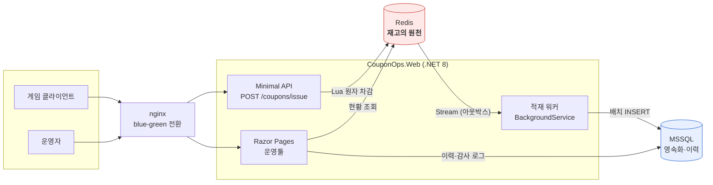
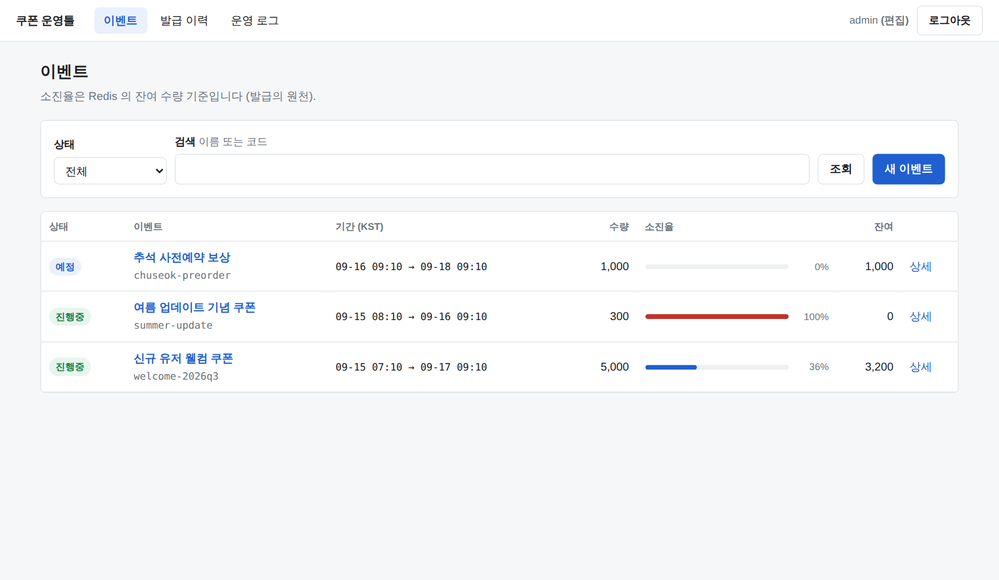

# coupon-ops-tool

**선착순 쿠폰 발급 API와 운영툴 PoC.**
동시 요청이 아무리 몰려도 발급 수가 설정 수량을 넘지 않는다 — 그것을 실행 가능한 테스트와 부하 측정으로 증명한다.

.NET 8 · MSSQL · Redis · Docker · GitHub Actions · k6

---

## 아키텍처



**Redis 가 재고의 원천(source of truth)이고, DB 는 비동기로 따라온다.**
유저가 기다리는 시간과 DB 가 감당하는 시간을 분리한 것이 이 설계의 핵심이다.

---

## 해결한 문제 — 선착순 발급의 동시성

재고 확인과 차감을 따로 하면(`GET` → 판단 → `DECR`) 두 명령 사이에 다른 요청이 끼어든다.
`DECR` 만 쓰면 원자적이지만 재고가 음수로 내려가 **초과 발급**이 된다.

**Lua 스크립트 안에서 재고·유저 한도·멱등 키를 한 번에 처리한다.**
Redis 에서 스크립트는 단일 명령처럼 원자적으로 실행되므로, 그 안에서는 "확인 후 차감" 이 안전하다.

```
1. 멱등 검사       GET  {evt:N}:req:<rid>      → 있으면 최초 결과 재생
2. 메타 로드       HMGET {evt:N}:meta
3. 거부 검증(읽기)  중단 → 기간 → 유저 한도
4. 코드 확보       LPOP {evt:N}:pool           ← 재고 판정과 코드 배정을 겸한다
5. 발급 확정(쓰기)  HINCRBY users / SET req / XADD issued
```

순서를 지배하는 원칙이 둘 있다.

- **멱등 검사가 가장 먼저다.** 기간 검사를 먼저 두면 "이미 발급받은 유저가 종료 후 재시도" 가
  `OutOfPeriod` 로 응답되어 최초 결과와 달라진다 — 멱등성이 깨진다.
- **읽기 검증을 전부 끝낸 뒤에야 쓰기를 시작한다.** Redis 는 Lua 실행 중 오류가 나도
  **앞서 실행된 명령을 되돌리지 않는다.** 검증과 쓰기를 섞으면 뒤쪽에서 거부될 때
  앞에서 깎은 재고가 그대로 증발한다.

예외는 `LPOP` 하나다. 쓰기지만 실패 시(nil) 아무것도 바꾸지 않아 되돌릴 것이 없고,
**재고 판정과 코드 배정을 겸하므로** "재고는 깎였는데 코드가 없다" 는 상태가 구조적으로 생기지 않는다.

→ 전문: [`docs/02-issue-api.md`](docs/02-issue-api.md) · [`issue_coupon.lua`](src/CouponOps.Web/Infrastructure/Redis/Scripts/issue_coupon.lua)

---

## 성능 — Redis Lua vs DB 비관적 락

같은 규칙·같은 이력 스키마로 **세 경로를 같은 조건에서** 측정했다.
셋 다 **초과 발급 0건** 이다 — 정확성을 포기해서 얻은 속도가 아니다.

| 경로 | VU | 처리량 | p50 | p95 | p99 |
|---|---:|---:|---:|---:|---:|
| **Redis Lua** | 200 | **8,912/s** | 14 ms | 37 ms | **64 ms** |
| DB 이벤트행 락 | 200 | 223/s | 779 ms | 1,008 ms | 1,552 ms |
| DB READPAST | 200 | 395/s | 328 ms | 860 ms | 2,246 ms |
| **Redis Lua** | 3,000 | **8,495/s** | 145 ms | 391 ms | **551 ms** |
| DB 이벤트행 락 | 3,000 | 202/s | 12,069 ms | 15,156 ms | 15,804 ms |
| DB READPAST | 3,000 | 322/s | 6,605 ms | 10,914 ms | 14,596 ms |

**처리량 22~44배, p99 응답시간 1/25~1/29.**

기울기가 핵심이다. **DB 는 VU 를 15배 늘려도 처리량이 그대로고**(223 → 202) 대기 시간만 15배 늘어난다.
그것이 직렬화의 정의다 — 더 많이 몰려와도 초당 처리량은 변하지 않고 줄만 길어진다.

### 소진 정확성 (재고 10,000 / VU 300)

| 경로 | 발급 성공 | 초과 발급 |
|---|---:|---:|
| Redis Lua | **10,000** | 0 |
| DB 이벤트행 락 | **10,000** | 0 |
| DB READPAST | **10,000** | 0 |

Redis 경로는 총 **251,957건**의 요청을 처리하면서 정확히 10,000건만 발급했다.

> **비교군을 제대로 만드는 데 시간을 썼다.** 처음 구현한 DB 경로는 200 VU 에서 **5.6 req/s**,
> 요청의 94%가 타임아웃이었다. 실행 계획을 떠보니 유저 한도 조회가 **인덱스 스캔**이었고,
> 그 질의에 걸린 `UPDLOCK, HOLDLOCK` 때문에 **모든 트랜잭션이 25만 행에 범위 잠금**을 걸고 있었다.
> 필터드 인덱스 하나를 추가하자 **5.6 → 223 req/s (40배)**.
> 그 상태로 리포트했다면 "Redis 가 1,500배 빠르다" 는 거짓 결론이 나왔을 것이다.

→ 전문·측정 환경의 한계: [`docs/load-test.md`](docs/load-test.md)

---

## 실행

```bash
docker compose up -d --wait
```

| | |
|---|---|
| 운영툴 · API | http://localhost:8080 |
| 계정 | `admin` / `admin1234` (편집), `viewer` / `admin1234` (읽기전용) |
| 헬스체크 | http://localhost:8080/health/ready |

발급 호출:

```bash
curl -X POST http://localhost:8080/api/events/1/coupons/issue \
  -H 'Content-Type: application/json' \
  -d '{"userId":"player-1234"}'
```

테스트와 부하 측정:

```bash
dotnet test                                    # 통합 테스트 46건 (Testcontainers)
bash loadtest/run-comparison.sh /tmp/results   # 3경로 × 3 VU 레벨
bash deploy/deploy.sh couponops:local          # 무중단 배포 (blue-green)
```

---

## 운영툴



이벤트 목록(상태 필터·소진율) · 생성/수정 · 실시간 소진 현황 · 발급 이력 · 운영 로그.
쿠키 인증에 읽기전용/편집 권한을 구분하고, **모든 변경 액션이 변경 전/후 값과 함께 운영 로그에 남는다.**

→ [`docs/03-admin-tool.md`](docs/03-admin-tool.md)

---

## 기술 선택 근거

### 왜 Redis Lua 인가

DB 트랜잭션으로도 정확성은 얻을 수 있다(위 표가 그 증거다). 차이는 **구조**다.

| | Redis Lua | DB 트랜잭션 |
|---|---|---|
| 차감 단위 | 인메모리 정수 연산 1회 | 트랜잭션 시작 → 잠금 → I/O → 커밋 |
| 직렬화 범위 | 스크립트 단위 (수 µs) | 잠금 보유 시간 전체 (수 ms) |
| 커넥션 | 발급 중 DB 커넥션 **0개** | 요청당 1개를 트랜잭션 내내 점유 |
| 응답까지 필요한 작업 | 재고 차감만 | 재고 차감 + 이력 INSERT |

**Redis 장애 시에는 fail-fast 한다 — DB 로 우회하지 않는다.**
재고의 원천이 둘이 되는 순간 "정확히 N개" 를 보증할 수 없기 때문이다.
초과 발급은 보상이 어렵지만(이미 유저 손에 코드가 있다) 짧은 발급 거부는 재시도로 회복된다.
비대칭적인 비용이므로 거부를 택했다.

### 왜 Razor Pages 인가

운영툴의 사용자는 **운영자 몇 명**이고, 화면은 목록·폼·상세뿐이다.

- 별도 SPA 는 빌드 파이프라인·상태 관리·API 스키마 동기화라는 비용을 달고 온다.
  얻는 것(클라이언트 라우팅, 풍부한 상호작용)이 이 화면들에는 필요 없다.
- 서버 렌더링이라 **인증·권한 판단이 한 곳에 모인다.** SPA 였다면 화면 가드와 API 가드를
  양쪽에 두고 어긋나지 않게 관리해야 한다.
- 단일 프로젝트라 배포 단위가 하나다.
- 실시간 갱신은 **3초 폴링**으로 충분하다. WebSocket 은 연결 관리·재연결·스케일아웃 백플레인
  비용을 달고 오는데, 운영자 몇 명에게 3초 지연은 의사결정에 영향이 없다.

### 왜 쿠폰 코드를 사전 생성하는가

발급 시 생성하면 코드와 재고가 별개 자원이 되어 원자성을 따로 보증해야 한다.
사전 생성하면 `LPOP` 한 번이 둘을 겸한다 — 증명할 것이 하나 줄어든다.
(발급 시 파생하는 `Derived` 모드도 함께 구현했다. 시퀀스에서 파생하므로 충돌이 원천적으로 없다.)

→ [`docs/01-domain-design.md`](docs/01-domain-design.md)

---

## CI/CD

```
브랜치 푸시 / PR  →  빌드 · 테스트 · 커버리지  →  무중단 배포 · 롤백 시연
main 머지        →  이미지 빌드 · GHCR 푸시
```

**`deploy-smoke` 잡이 매번 무중단 배포와 롤백을 실제로 수행한다.**
배포하는 동안 프록시로 요청을 계속 보내고, **실패가 한 건이라도 나오면 잡이 실패한다.**
"무중단" 을 주장하려면 그것을 측정해야 한다.

로컬 실측:

| 시나리오 | 결과 |
|---|---|
| 정상 배포 (blue → green) | 요청 **471건 · 실패 0건**, 준비까지 3초 |
| 실패 주입 | 요청 **8,993건 · 실패 0건**, 전환 안 함, 트래픽 유지, 종료 코드 1 |

<!-- CI-TIMINGS -->

→ 트레이드오프 정리: [`docs/cicd.md`](docs/cicd.md)

---

## 구조

```
src/CouponOps.Web/          단일 프로젝트 (Minimal API + Razor Pages)
├─ Domain/                  엔티티·규칙 (의존성 없음)
├─ Application/             유스케이스
├─ Api/                     발급 API · 현황 · 헬스체크
├─ Infrastructure/
│  ├─ Redis/Scripts/        issue_coupon.lua  ← 동시성 제어의 핵심
│  ├─ Persistence/          EF Core · 마이그레이션
│  └─ Workers/              비동기 적재 워커
└─ Pages/                   운영툴

tests/CouponOps.Tests/      통합 테스트 46건 (Testcontainers, 실제 MSSQL·Redis)
loadtest/                   k6 시나리오 + 측정 스크립트
deploy/                     blue-green 배포 스크립트 · nginx
docs/                       설계·측정·CI/CD·AI 활용 기록
```

폴더 경계로 의존 방향을 강제한다. PoC 규모에서 Clean Architecture 4-프로젝트 분할은
리뷰어가 코드를 따라가는 비용만 늘린다.

---

## 문서

| | |
|---|---|
| [1단계 — 도메인 설계](docs/01-domain-design.md) | ERD, 엔티티, 인덱스 설계 근거 |
| [2단계 — 발급 API와 동시성](docs/02-issue-api.md) | Lua 순서 근거, fail-fast 판단 |
| [3단계 — 운영툴](docs/03-admin-tool.md) | 권한 구분, 위험 액션 확인 절차 |
| [4단계 — 부하 테스트](docs/load-test.md) | 측정 환경의 한계까지 포함한 비교 리포트 |
| [5단계 — CI/CD](docs/cicd.md) | Jenkins vs Actions, 컨테이너 배포 트레이드오프 |
| [AI 활용 기록](docs/ai-usage.md) | 무엇을 AI 로 만들었고 어떻게 검증했는가 |
