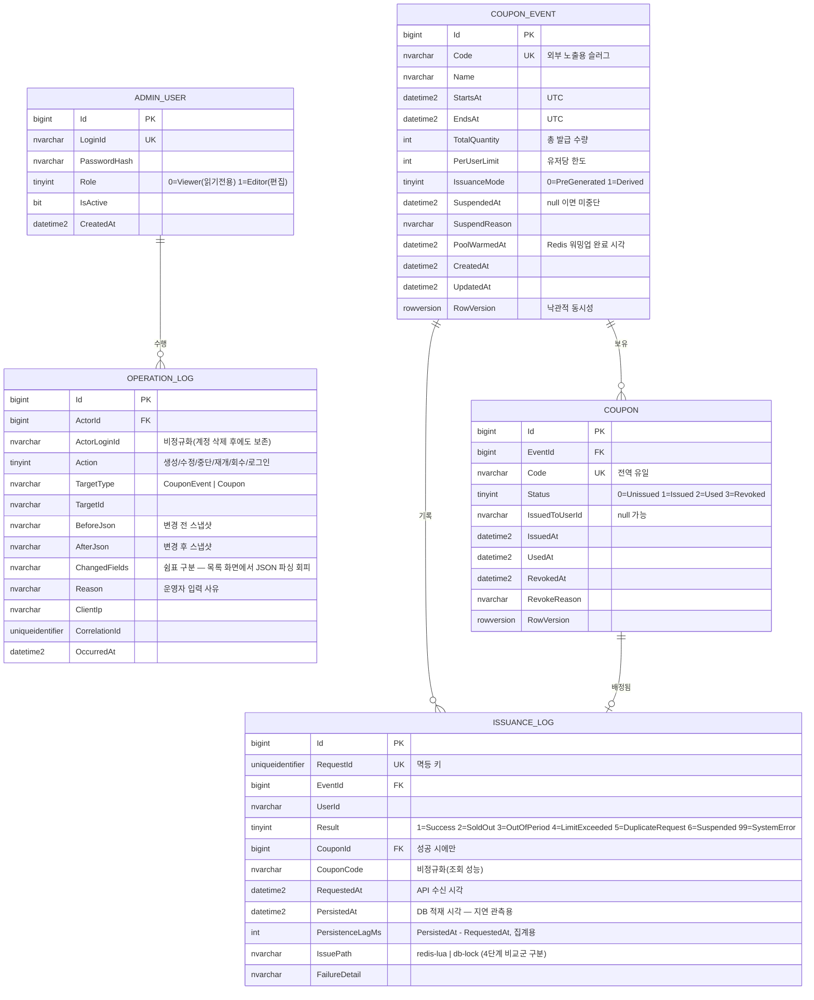

# 1단계 — 도메인 설계안

> 상태: **승인 대기**. 이 문서는 설계안이며 아직 구현 코드는 작성하지 않았다.
> 아래 엔티티 클래스는 "초안"이며 실제 프로젝트 파일이 아니다.

---

## 0. 프로젝트 구조 제안

```
game-event-ops-poc/
├─ src/CouponOps.Web/                 # .NET 8 단일 프로젝트 (Minimal API + Razor Pages)
│  ├─ Program.cs                      # DI, 파이프라인, 엔드포인트/페이지 등록
│  ├─ Api/
│  │  ├─ IssueEndpoints.cs            # POST /api/events/{id}/coupons/issue  (Redis Lua)
│  │  ├─ IssueDbEndpoints.cs          # POST .../issue-db  (비관적 락 — 4단계 비교군)
│  │  └─ HealthEndpoints.cs           # GET /health (Redis/MSSQL 개별 확인 — 5단계)
│  ├─ Pages/Admin/                    # 3단계 운영툴 (Events, Issuances, OperationLogs)
│  ├─ Domain/                         # 엔티티 + enum + 도메인 규칙 (의존성 없음)
│  ├─ Application/                    # IssueCouponService, EventAdminService, IAuditLogger
│  ├─ Infrastructure/
│  │  ├─ Persistence/                 # AppDbContext, IEntityTypeConfiguration, Migrations
│  │  ├─ Redis/                       # IIssuanceStore, RedisIssuanceStore, Scripts/*.lua
│  │  └─ Workers/                     # IssuancePersistenceWorker (Stream → DB 배치 적재)
│  └─ wwwroot/site.css                # 순수 CSS
├─ tests/CouponOps.Tests/             # xUnit — 단위 + Testcontainers 통합
├─ loadtest/                          # 4단계 k6 스크립트
├─ docs/                              # 설계·부하테스트·CI/CD·AI 활용 기록
├─ docker-compose.yml / Dockerfile
└─ .github/workflows/
```

**단일 프로젝트로 두는 이유**: PoC 규모에서 Clean Architecture 4-프로젝트 분할은 리뷰어가 코드를 따라가는 비용만 늘린다.
대신 **폴더 경계로 의존 방향을 강제**한다 (`Domain` → 무의존, `Application` → `Domain`,
`Infrastructure` → `Application`+`Domain`, `Api`/`Pages` → 전부). 테스트 프로젝트만 분리한다.

**`issue`(Redis Lua)와 `issue-db`(비관적 락) 두 엔드포인트를 처음부터 둔다**:
4단계 비교 측정이 이 PoC의 핵심 근거이므로, 두 경로가 **동일한 `IssuanceLog` 스키마에 기록**되도록
설계 단계에서 맞춰 둔다. 나중에 비교군을 급조하면 스키마가 갈라져 수치 비교가 불공정해진다.

---

## 1. 쿠폰 코드: 사전 생성 vs 발급 시 생성 (요청하신 트레이드오프 우선 설명)

### A. 사전 생성 (Pre-generated)
이벤트 생성 시 N개의 코드를 미리 만들어 `Coupons` 테이블에 적재하고, 오픈 전 Redis 리스트로 워밍업한다.

| | 내용 |
|---|---|
| 장점 | 코드 유일성을 **DB UNIQUE 인덱스로 사전 검증** — 발급 hot path에 충돌 재시도 경로가 없다 |
| | **재고 = 코드 풀의 길이**. 카운터와 코드 풀이 이중 원천이 되지 않아 정합성 논증이 단순하다 |
| | 제휴사 배포, 코드 형식 사전 검수, 사후 감사(미발급분 회수)가 가능 |
| | 발급이 `LPOP` 한 번 — O(1), 추가 연산 없음 |
| 단점 | 대량(수천만 건) 사전 생성 시 생성 시간·저장 공간 비용. 오픈 전 **워밍업 단계**가 운영 절차에 추가된다 |
| | 수량 증량 시 코드 추가 생성 필요, 미발급 코드 폐기 관리 부담 |
| | Redis 메모리에 코드 문자열 N개가 상주 (1,000만 × 16B ≈ 수백 MB) |

### B. 발급 시 생성 (On-demand)

| | 내용 |
|---|---|
| 장점 | 사전 작업·저장 공간 없음. 수량 변경이 카운터 값 하나 수정으로 끝난다 |
| | Redis 메모리가 코드 개수에 비례하지 않는다 (카운터 + 유저별 발급 기록만) |
| 단점 | 순수 랜덤 생성 시 **충돌 처리 경로**가 hot path에 생긴다. Redis가 source of truth인데 유일성 보증은 DB에 있어, 비동기 적재 중 충돌이 드러나면 이미 유저에게 성공 응답을 보낸 뒤다 |
| | 재고 카운터와 코드가 별개 원천 → "카운터는 깎였는데 코드 생성 실패" 같은 상태를 별도로 다뤄야 한다 |
| | 발급 즉시 사용(use) 검증 시 DB에 아직 행이 없어, 검증 경로가 Redis를 봐야 한다 |

### 결론 (제안)
**사전 생성을 기본값으로 채택**하고, `Event.IssuanceMode` 컬럼으로 두 방식을 모두 지원한다.

- 근거 1 — 이 PoC의 증명 대상은 "**정확히 N개만 발급**"이다. 사전 생성은 재고 판정과 코드 배정이
  `LPOP` **단일 연산**으로 합쳐져, "재고를 깎았는데 코드가 없다"는 상태가 **구조적으로 발생 불가**하다.
  카운터 방식은 두 자원의 원자성을 Lua로 별도 보증해야 한다(가능하지만, 증명할 것이 하나 늘어난다).
- 근거 2 — On-demand를 쓰더라도 **랜덤 생성은 채택하지 않는다**. `INCR`로 받은 시퀀스에
  `code = Base32(HMAC-SHA256(serverSecret, eventId || seq))[0..11]` 를 적용하면
  단조 시퀀스에서 결정적으로 파생되므로 **충돌이 원천적으로 불가능**하고 추측도 어렵다.
  즉 On-demand의 최대 단점(충돌 재시도)은 설계로 제거할 수 있으며, 이 방식을 `IssuanceMode.Derived`로 구현한다.
- 근거 3 — 두 모드를 모두 두면 4단계 부하 테스트에서 **"코드 풀 LPOP" vs "카운터 DECR + 파생 코드"**의
  메모리/지연 차이를 추가 비교군으로 제시할 수 있다. 비용이 거의 들지 않는 확장이다.

> 전제: 쿠폰 코드는 **추측 불가능(unguessable)** 해야 한다. 순차 번호를 그대로 노출하면
> 열거 공격으로 남의 코드를 사용할 수 있다. 두 모드 모두 이 요건을 만족시킨다.

---

## 2. 이벤트 상태: 저장 vs 파생 (설계 쟁점)

요구된 상태는 `예정 / 진행중 / 종료 / 중단` 4가지다. 이 중 **3개는 시각의 함수**이고 1개만 운영자 액션이다.

- **전부 컬럼에 저장**하면 → `Scheduled → Active` 전이를 위해 스케줄러가 필요하고,
  스케줄러가 밀리면 "시작 시각이 지났는데 아직 예정" 상태가 DB에 남는다. **거짓 상태**가 생긴다.
- **전부 파생**하면 → 저장은 정직해지지만 운영자의 "강제 중단"을 표현할 곳이 없다.

**제안**: 저장하는 것은 운영자 액션뿐이다.

```
Events 테이블 저장 컬럼:   StartsAt, EndsAt, SuspendedAt (nullable), SuspendReason
파생 규칙(단일 정의):
  SuspendedAt != null        → Suspended
  now <  StartsAt            → Scheduled
  now >= EndsAt              → Ended
  그 외                       → Active
```

파생 규칙은 `EventStatusRules.ToStatus(e, now)` 한 곳에만 두고,
**동일 규칙을 `Expression<Func<CouponEvent, EventStatus>>`로도 노출**해 EF Core가 SQL로 번역하게 한다.
→ 운영툴 목록의 상태별 필터가 메모리 필터링이 아니라 **인덱스를 타는 WHERE 절**이 된다.
스케줄러 없이도 상태가 항상 정확하고, 규칙이 C#과 SQL에서 갈라지지 않는다.

---

## 3. ERD



### 관계에 대한 메모
- `COUPON ||--o| ISSUANCE_LOG`: 성공 로그 1건이 쿠폰 1장에 대응한다. 실패 로그는 `CouponId`가 null이다.
  → FK는 nullable, `ON DELETE NO ACTION`. 이력 테이블은 어떤 경우에도 CASCADE 삭제되지 않는다.
- `OPERATION_LOG`는 **의도적으로 FK를 TargetId(문자열)로 느슨하게** 잡았다.
  감사 로그는 대상 테이블이 늘어날 때마다 스키마가 바뀌면 안 되고, 대상이 삭제돼도 남아야 한다.
- `ActorLoginId` 비정규화: 운영자 계정이 비활성/삭제돼도 "누가 바꿨는지"가 로그 안에서 자립해야 한다.

---

## 4. 엔티티 클래스 초안

```csharp
// ── Domain/Enums.cs ─────────────────────────────────────────────
public enum EventStatus : byte { Scheduled = 0, Active = 1, Ended = 2, Suspended = 3 }
public enum IssuanceMode : byte { PreGenerated = 0, Derived = 1 }
public enum CouponStatus : byte { Unissued = 0, Issued = 1, Used = 2, Revoked = 3 }

public enum IssueResult : byte
{
    Success          = 1,
    SoldOut          = 2,   // 수량 소진
    OutOfPeriod      = 3,   // 기간 외
    LimitExceeded    = 4,   // 유저당 한도 초과
    DuplicateRequest = 5,   // 동일 RequestId 재요청 (멱등 처리)
    Suspended        = 6,   // 운영자 강제 중단
    SystemError      = 99,
}

public enum OperationAction : byte
{
    EventCreated = 0, EventUpdated = 1, EventSuspended = 2, EventResumed = 3,
    CouponPoolWarmed = 4, CouponRevoked = 5, AdminSignedIn = 6,
}

// ── Domain/CouponEvent.cs ───────────────────────────────────────
public class CouponEvent
{
    public long Id { get; private set; }
    public string Code { get; private set; } = default!;       // 외부 노출 슬러그
    public string Name { get; private set; } = default!;

    public DateTime StartsAt { get; private set; }             // UTC, datetime2(3)
    public DateTime EndsAt { get; private set; }
    public int TotalQuantity { get; private set; }
    public int PerUserLimit { get; private set; }
    public IssuanceMode IssuanceMode { get; private set; }

    public DateTime? SuspendedAt { get; private set; }         // 저장되는 유일한 '상태'
    public string? SuspendReason { get; private set; }
    public DateTime? PoolWarmedAt { get; private set; }

    public DateTime CreatedAt { get; private set; }
    public DateTime UpdatedAt { get; private set; }
    public byte[] RowVersion { get; private set; } = default!; // 운영자 동시 편집 감지

    // 상태는 저장하지 않고 파생한다 (2장 참조)
    public EventStatus StatusAt(DateTime utcNow) =>
        SuspendedAt is not null    ? EventStatus.Suspended
        : utcNow <  StartsAt       ? EventStatus.Scheduled
        : utcNow >= EndsAt         ? EventStatus.Ended
                                   : EventStatus.Active;

    // 위와 같은 규칙. EF Core가 SQL CASE 식으로 번역한다.
    public static Expression<Func<CouponEvent, EventStatus>> StatusExpr(DateTime utcNow) =>
        e => e.SuspendedAt != null   ? EventStatus.Suspended
           : utcNow <  e.StartsAt    ? EventStatus.Scheduled
           : utcNow >= e.EndsAt      ? EventStatus.Ended
                                     : EventStatus.Active;

    public IReadOnlyList<string> Validate() { /* EndsAt > StartsAt, TotalQuantity > 0, PerUserLimit ∈ [1, TotalQuantity] */ }
}

// ── Domain/Coupon.cs ────────────────────────────────────────────
public class Coupon
{
    public long Id { get; private set; }
    public long EventId { get; private set; }
    public string Code { get; private set; } = default!;       // 전역 UNIQUE
    public CouponStatus Status { get; private set; }
    public string? IssuedToUserId { get; private set; }
    public DateTime? IssuedAt { get; private set; }
    public DateTime? UsedAt { get; private set; }
    public DateTime? RevokedAt { get; private set; }
    public string? RevokeReason { get; private set; }
    public byte[] RowVersion { get; private set; } = default!;
}

// ── Domain/IssuanceLog.cs ───────────────────────────────────────
public class IssuanceLog
{
    public long Id { get; private set; }
    public Guid RequestId { get; private set; }                // UNIQUE — 재처리 멱등
    public long EventId { get; private set; }
    public string UserId { get; private set; } = default!;
    public IssueResult Result { get; private set; }
    public long? CouponId { get; private set; }
    public string? CouponCode { get; private set; }            // 비정규화: 이력 조회 시 JOIN 제거
    public DateTime RequestedAt { get; private set; }          // API 수신 시각
    public DateTime PersistedAt { get; private set; }          // DB 적재 시각 → lag 관측
    public int PersistenceLagMs { get; private set; }         // PersistedAt - RequestedAt
    public string IssuePath { get; private set; } = default!;  // "redis-lua" | "db-lock"
    public string? FailureDetail { get; private set; }
}

// ── Domain/OperationLog.cs ──────────────────────────────────────
public class OperationLog
{
    public long Id { get; private set; }
    public long ActorId { get; private set; }
    public string ActorLoginId { get; private set; } = default!;
    public OperationAction Action { get; private set; }
    public string TargetType { get; private set; } = default!;
    public string TargetId { get; private set; } = default!;
    public string? BeforeJson { get; private set; }
    public string? AfterJson { get; private set; }
    public string? ChangedFields { get; private set; }
    public string? Reason { get; private set; }
    public string? ClientIp { get; private set; }
    public Guid CorrelationId { get; private set; }
    public DateTime OccurredAt { get; private set; }
}

// ── Domain/AdminUser.cs ─────────────────────────────────────────
public class AdminUser
{
    public long Id { get; private set; }
    public string LoginId { get; private set; } = default!;
    public string PasswordHash { get; private set; } = default!;  // PBKDF2 (ASP.NET Core PasswordHasher)
    public AdminRole Role { get; private set; }                   // Viewer | Editor
    public bool IsActive { get; private set; }
    public DateTime CreatedAt { get; private set; }
}
```

### 공통 규약
- **모든 시각은 UTC**, `datetime2(3)`. 표시 시점에만 KST 변환. (오픈 시각 버그의 단골 원인 제거)
- `UserId`는 `nvarchar(64)` **문자열**. 게임사 유저 ID는 숫자가 아닌 경우가 흔하고,
  PoC가 특정 ID 체계에 묶이지 않게 한다. 인덱스 폭이 커지는 비용은 감수한다.
- `RowVersion`은 **운영자가 편집하는 엔티티**(Event, Coupon)에만 둔다.
  이력 테이블은 append-only이므로 불필요하다.

---

## 5. Redis 키 설계 (2단계 선반영 — 스키마 정합성 확인용)

| 키 | 타입 | 용도 |
|---|---|---|
| `{evt:1}:pool` | LIST | 사전 생성 코드 풀. `LPOP` = 재고 판정 + 코드 배정 (PreGenerated) |
| `{evt:1}:stock` | STRING(int) | 잔여 수량 카운터 (Derived 모드) |
| `{evt:1}:seq` | STRING(int) | 코드 파생용 단조 시퀀스 (Derived 모드) |
| `{evt:1}:users` | HASH(userId → count) | 유저별 발급 횟수 — 한도 검사 |
| `{evt:1}:req:{reqId}` | STRING | 멱등 키. `SET NX EX`. 중복 요청 판별 |
| `{evt:1}:issued` | STREAM | DB 적재용 아웃박스. Consumer Group으로 배치 소비 |
| `{evt:1}:meta` | HASH | startsAt/endsAt/perUserLimit/suspended — Lua 내부 검증용 |

- **모든 키에 `{evt:1}` 해시 태그를 붙인다.** Lua 스크립트가 한 이벤트의 여러 키를 동시에 만지므로,
  Redis Cluster로 확장할 때 같은 슬롯에 있어야 `CROSSSLOT` 오류가 나지 않는다. 단일 노드에서도 지금 정해둔다.
- `users` 해시는 유저 수만큼 필드가 늘어난다(수십만 이상 시 hot key). 대안인
  유저별 개별 키(`{evt:1}:u:{userId}`)와의 트레이드오프는 2단계에서 측정치와 함께 제시한다.
- 기간·중단 검사를 **Lua 안에서 `meta` 기준으로** 수행한다. 앱이 판단한 뒤 Lua를 호출하면
  판단과 차감 사이에 이벤트가 중단될 수 있다(TOCTOU).

---

## 6. 인덱스 설계와 근거

### `Events` (수백~수천 행)
| 인덱스 | 근거 |
|---|---|
| CLUSTERED PK (`Id`) | BIGINT IDENTITY, 단조 증가 |
| UNIQUE (`Code`) | 외부 노출 슬러그. 중복 생성 방지 + 코드 조회 |
| (`SuspendedAt`, `StartsAt` DESC) | 운영툴 목록의 상태 필터 + 최신순 정렬. 단, **행 수가 작아 실효는 낮다** — 규모가 커질 때를 위한 것이고, 지금은 스캔해도 무방하다는 점을 명시한다 |

### `Coupons` (이벤트당 최대 TotalQuantity, 수백만 가능)
| 인덱스 | 근거 |
|---|---|
| CLUSTERED PK (`Id`) | 사전 생성 시 **순차 대량 삽입** → 페이지 분할 없음. `SqlBulkCopy`와 궁합이 좋다 |
| UNIQUE (`Code`) | 코드 유일성의 **최종 방어선**이자 사용(use) API의 O(1) 조회 경로. 전역 유일이라 이벤트를 몰라도 코드만으로 찾는다 |
| (`EventId`, `Status`) WHERE `Status = 0` | 필터드 인덱스. Redis 워밍업 시 **미발급분만** range scan. 발급이 진행될수록 인덱스가 작아진다 |
| (`EventId`, `IssuedToUserId`) WHERE `IssuedToUserId IS NOT NULL` | CS 대응 — "이 유저가 이 이벤트에서 받은 쿠폰". 미발급 행(대다수)을 인덱스에서 제외 |

### `IssuanceLogs` (최다 쓰기 테이블 — 성공 + 실패 전부)
| 인덱스 | 근거 |
|---|---|
| CLUSTERED PK (`Id`) + `OPTIMIZE_FOR_SEQUENTIAL_KEY = ON` | append-only. 단조 키는 페이지 분할이 없는 대신 **마지막 페이지 삽입 경합**이 생긴다 → SQL Server 2019+ 옵션으로 완화하고, 근본적으로는 배치 삽입으로 삽입 횟수 자체를 줄인다 |
| UNIQUE (`RequestId`) | **비동기 적재의 핵심**. Redis Stream 소비는 at-least-once라 재처리가 정상 동작이다. 중복 행을 DB 제약으로 막는다 |
| (`EventId`, `RequestedAt` DESC) INCLUDE (`UserId`, `Result`, `CouponCode`) | 운영툴 이력 조회(이벤트 + 기간 + 페이징)의 주 경로. INCLUDE로 **커버링** → 키 조회 제거 |
| (`UserId`, `RequestedAt` DESC) | "이 유저가 언제 뭘 받았나" — CS 문의 대응 경로 |
| (`EventId`, `Result`, `RequestedAt`) WHERE `Result <> 1` | 실패 사유 분석 전용. 정상 운영에선 실패가 소수라 인덱스가 작다. 소진 후에는 실패가 폭증하므로 필터드로 **분리해 두는 것이 이득** |

**쓰기 비용에 대한 정직한 메모**: 인덱스 5개는 대량 쓰기 테이블에 가볍지 않다.
완화책 3가지를 함께 설계한다 —
(1) 성공 이력은 Redis Stream → **배치 커밋**(`SqlBulkCopy`, 수백 건 단위)으로 삽입 횟수를 줄인다,
(2) 실패 이력은 사유별 카운터를 Redis에 집계하고 **개별 행은 샘플링 비율 설정 가능**하게 둔다
(k6 스파이크에서 실패 로그가 성공 로그의 수십 배가 될 수 있다),
(3) `RequestedAt` 기준 월별 파티셔닝/아카이브 경로를 문서에 남긴다(PoC에서 구현은 하지 않는다).
4단계에서 인덱스 유무에 따른 처리량 차이를 측정해 이 판단을 수치로 검증한다.

### `OperationLogs`
| 인덱스 | 근거 |
|---|---|
| CLUSTERED PK (`Id`) | append-only |
| (`OccurredAt` DESC) | 운영 로그 기본 화면 = 전체 최신순 |
| (`ActorId`, `OccurredAt` DESC) | "이 운영자가 무엇을 했나" — 감사 시 첫 질문 |
| (`TargetType`, `TargetId`, `OccurredAt` DESC) | 이벤트 상세 화면의 "이 이벤트 변경 이력" 탭 |

`ChangedFields`를 별도 컬럼으로 두는 이유: 목록 화면에서 "무엇이 바뀌었는지"를 보여주려고
매 행의 `BeforeJson`/`AfterJson`(NVARCHAR(MAX), LOB)을 읽어 파싱하면 목록 조회가 급격히 느려진다.
diff 요약을 **쓰기 시점에 한 번 계산**해 저장한다.

### `AdminUsers`
UNIQUE (`LoginId`) — 그 외 없음.

---

## 7. 승인이 필요한 결정 사항

1. **쿠폰 코드: 사전 생성 기본 + `Derived` 모드 병행** (1장 결론) — 동의하시는지
2. **이벤트 상태를 컬럼에 저장하지 않고 파생** (2장) — 요구사항에는 "상태"가 명시돼 있어 확인이 필요
3. **`UserId`를 문자열(nvarchar(64))로** — 특정 ID 체계에 묶이지 않기 위함
4. **실패 이력 샘플링 옵션** — 전부 적재가 기본, 부하 테스트 시 비율 조정 가능하게
5. `issue`(Redis) / `issue-db`(비관적 락) **두 엔드포인트를 1단계 스키마부터 반영** — 4단계 비교 측정을 위해

승인해 주시면 2단계(발급 API + Lua + Testcontainers 테스트)로 넘어간다.
