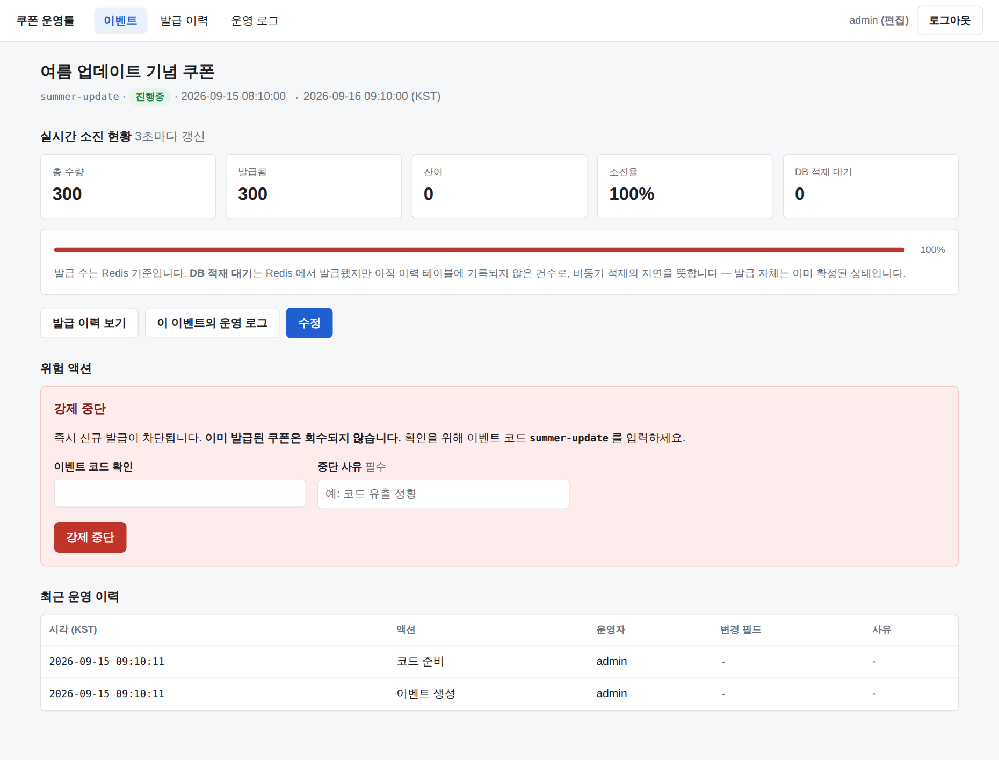
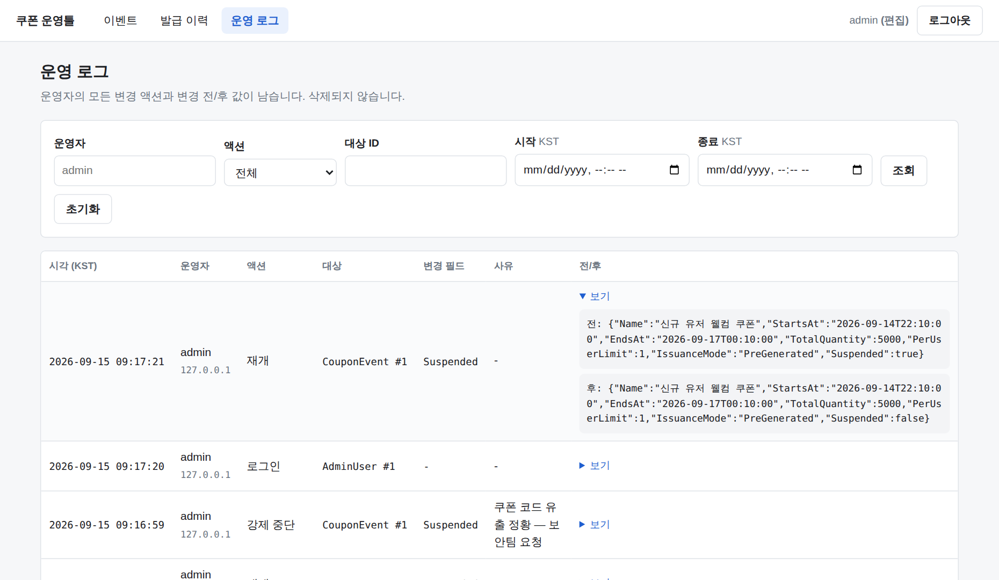

# 3단계 — 운영툴 (Razor Pages)

별도 SPA 없이 Razor Pages 로 구현한 백오피스. CSS 프레임워크 없이 순수 CSS(156줄).


---

## 화면

| 화면 | 경로 | 내용 |
|---|---|---|
| 이벤트 목록 | `/Events` | 상태별 필터, 이름·코드 검색, 소진율 바 |
| 이벤트 생성 | `/Events/Create` | 유효성 검증, 저장 시 코드 사전 생성 + Redis 워밍업 |
| 이벤트 수정 | `/Events/Edit` | 수량 변경 규칙 적용, 변경 사유 입력 |
| 이벤트 상세 | `/Events/Details` | 실시간 소진 현황(폴링), 강제 중단/재개, 최근 운영 이력 |
| 발급 이력 | `/Issuances` | 이벤트·유저ID·기간·결과 필터, 페이징 |
| 운영 로그 | `/OperationLogs` | 운영자·액션·대상·기간 필터, 변경 전/후 JSON |

---

## 실시간 소진 현황 — 폴링을 택한 이유



`GET /api/events/{id}/status` 를 3초마다 호출한다. WebSocket 을 쓰지 않았다.

- 화면을 보는 사람은 **운영자 몇 명**이고, 갱신 지연 3초는 의사결정에 영향이 없다.
- WebSocket 은 연결 상태 관리·재연결·스케일아웃 시 백플레인이라는 비용을 달고 온다.
  얻는 것(3초 → 즉시)에 비해 치를 값이 크다.
- 탭이 백그라운드면 폴링을 멈춘다(`document.hidden`). 운영툴은 열어둔 채 방치되는 일이 흔하다.

**`DB 적재 대기`** 지표를 같이 보여준다. Redis 기준 발급 수와 DB 이력 건수의 차이다.
"발급은 됐는데 이력이 아직 안 보인다"는 문의를 만들지 않기 위한 것이고,
비동기 적재 구조를 화면에서 그대로 드러내는 편이 정직하다.

---

## 권한 — 읽기전용 / 편집

쿠키 인증(8시간, `HttpOnly`, `SameSite=Strict`). 역할은 둘이다.

| | Viewer (읽기전용) | Editor (편집) |
|---|---|---|
| 목록·상세·이력·로그 조회 | O | O |
| 현황 API | O | O |
| 이벤트 생성·수정 | X | O |
| 강제 중단·재개 | X | O |

**UI 에서 버튼을 숨기는 것으로 끝내지 않는다.** Razor Pages 는
`o.Conventions.AuthorizeFolder("/")` 로 **기본값이 "로그인 필요"** 이고,
변경 화면은 `[Authorize(Policy = Policies.Editor)]`, 핸들러는 `actor.CanEdit` 로 한 번 더 막는다.
읽기전용 계정이 폼을 직접 POST 해도 거부되는 것을 테스트로 확인한다.

새 페이지를 추가하면서 인증을 깜빡해도 열리지 않는다 — 기본값이 잠김이기 때문이다.

---

## 위험 액션의 확인 절차

강제 중단은 되돌리기 어렵다(이미 나간 쿠폰은 회수되지 않는다). 세 겹으로 막는다.

1. **이벤트 코드 직접 입력** — `confirm()` 한 번으로는 부족하다.
   옆 탭의 다른 이벤트를 중단시키는 실수를 막으려면 **대상을 직접 지목**하게 해야 한다.
2. **중단 사유 필수** — 운영 로그에 남는다. 사유 없는 중단은 사후 조사에서 아무것도 설명하지 못한다.
3. 브라우저 `confirm()` — 오클릭 방어.

1·2 는 **서버에서 검증**한다. 클라이언트 검증만으로는 방어가 아니다.

---

## 모든 변경은 운영 로그에 남는다



`IAuditLogger` 가 변경 전/후 스냅샷과 **바뀐 필드 이름**을 기록한다.

- **`SaveChanges` 는 호출자가 한다.** 변경과 감사 로그가 같은 트랜잭션에서 커밋돼야
  "바뀌었는데 기록이 없는" 상태가 생기지 않는다.
- `ChangedFields` 는 쓰기 시점에 한 번 계산한다. 목록 화면이 매 행의 Before/After(LOB)를
  파싱하면 조회가 급격히 느려진다.
- **로그인도 감사 대상**이다. "누가 언제 들어왔나" 는 사고 조사의 출발점이다.

---

## 수량 변경 규칙

이벤트 수정에서 수량은 자유롭게 바꿀 수 없다.

| 이벤트 상태 | 수량 변경 | 처리 |
|---|---|---|
| 예정 (Scheduled) | 자유 | 아직 아무도 발급받지 않았으므로 풀 전체 재워밍업 |
| 진행중 이후 | **증량만** | 기존 풀 **뒤에 덧붙인다** (`RPUSH`) |
| 진행중 이후 | 감량 거부 | 이미 나간 쿠폰을 되돌릴 수 없고, 풀을 잘라내면 누가 못 받게 되는지 예측할 수 없다 |

증량 시 풀을 다시 만들지 않는 것이 핵심이다. 통째로 재워밍업하면 **이미 소진된 수량이 되살아난다.**
테스트가 이를 직접 확인한다 — 5개 소진 후 8개로 증량하면 추가 발급은 정확히 3개다.

---

## 검증

```bash
bash scripts/dev-setup.sh
dotnet test
```

### 결과 (31 passed / 0 failed)

2단계 13건에 더해 운영툴 18건.

| 테스트 | 확인 내용 |
|---|---|
| 미인증 접근 → 로그인 리다이렉트 | `/Events`, `/Issuances`, `/OperationLogs` 전부 |
| 비밀번호 오류 | 로그인되지 않고, 아이디 존재 여부를 노출하지 않음 |
| 읽기전용 계정 | 조회 O / 생성 화면 접근 X |
| 읽기전용 계정의 중단 POST | 거부되고 **상태가 실제로 바뀌지 않음** |
| 확인 코드 불일치 | 중단되지 않고 **발급이 계속 가능함**(실제로 발급해 확인) |
| 중단 사유 누락 | 거부 |
| 강제 중단 | 발급이 즉시 `Suspended` 로 막히고, 전/후 JSON + `ChangedFields="Suspended"` 기록 |
| 재개 | 발급 재허용 + 로그 기록 |
| 폼으로 이벤트 생성 | Redis 워밍업까지 완료돼 **즉시 발급 가능**, 쿠폰 25건 적재, 생성 로그 |
| 잘못된 기간 | "종료 시각은 시작 시각보다 뒤여야 합니다" |
| 진행 중 감량 | 거부 + 수량 불변 |
| 진행 중 증량 | 5개 소진 후 8개로 증량 → **추가 발급 정확히 3개** |
| 현황 API | 소진율·잔여 반환, 읽기전용도 접근 가능, 미인증은 차단 |
| 상태 필터 | Active/Scheduled 가 서로를 섞지 않음 |
| 로그인 감사 액터 | `system` 이 아니라 실제 계정으로 기록 |
| 로그아웃 | 세션 종료 |

---

## 이번 단계에서 테스트·스크린샷이 잡은 실제 결함 4건

구현 직후에는 전부 "동작하는 것처럼" 보였다.

1. **로그아웃이 동작하지 않았다.**
   `<form method="post" action="/Account/Logout">` — `action` 을 직접 쓰면 `FormTagHelper` 가
   안티포저리 토큰을 넣지 않는다(태그 헬퍼는 자신이 `action` 을 생성한 폼에만 토큰을 추가한다).
   토큰 없는 POST 는 400 으로 거부된다. → `asp-page` + 명시적 `@Html.AntiForgeryToken()`.

2. **로그인 감사 로그의 운영자가 `system` 으로 찍혔다.**
   `SignInAsync` 는 응답 쿠키만 세팅한다. 같은 요청의 `HttpContext.User` 는 여전히 익명이라
   `ICurrentActor` 가 시스템 액터로 읽혔다. → `HttpContext.User = principal` 을 직접 설정.

3. **한글이 `&#xC774;` 로 이스케이프됐다.**
   기본 `HtmlEncoder` 는 비 ASCII 를 전부 숫자 참조로 바꾼다 — 응답 크기가 몇 배가 되고
   HTML 을 사람이 읽을 수 없다. → `TextEncoderSettings(UnicodeRanges.All)`.
   `<`, `>`, `&` 이스케이프는 그대로라 XSS 방어에는 영향이 없다.

4. **감사 로그 JSON 이 `신규` 로 저장됐다.**
   감사 로그는 사람이 읽는 것이 존재 이유인데 한글 값이 전부 이스케이프돼 쓸모가 없었다.
   → `JavaScriptEncoder.Create(UnicodeRanges.All)`.
   `UnsafeRelaxedJsonEscaping` 과 달리 HTML 민감 문자는 계속 막는다.

2·4 는 **스크린샷을 눈으로 확인해서** 발견했다. 테스트는 통과하고 있었다 —
"로그가 남는다"는 단언했지만 "읽을 수 있게 남는다"는 단언하지 않았기 때문이다.
지금은 둘 다 회귀 테스트가 있다.
